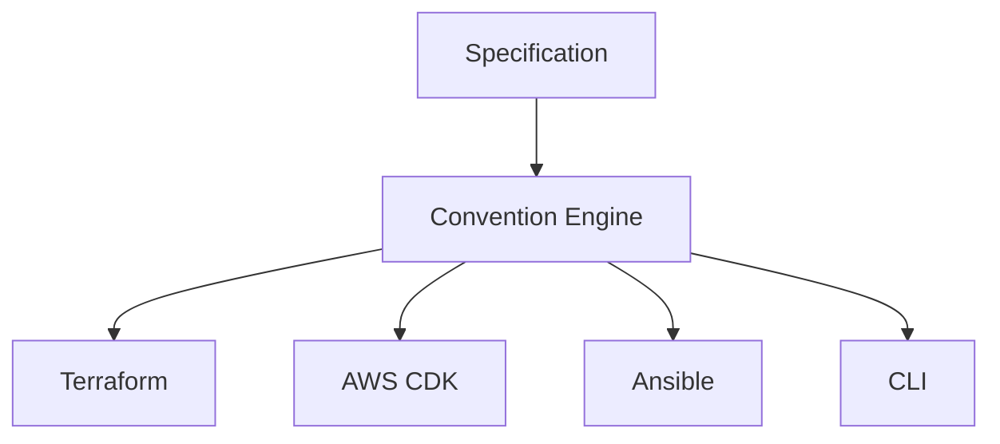

# IaC Resource Conventions

> **Project Status**
>
> 🚧 This project is currently under active development.
> APIs, convention packs, and adapters may change until the first stable release (v1.0.0).

## Overview

**IaC Resource Conventions** is an Open Source project that provides a unified Specification and
a set of SDKs for defining Infrastructure as Code resource conventions.

Teams adopting Infrastructure as Code across multiple platforms and tools typically end up
re-implementing the same organizational rules — naming schemes, tags, labels, metadata, and
validation — separately for every tool they use, which leads to drift and inconsistent behavior
over time. This project solves that problem by defining conventions once, in a single
Specification, and deriving consistent, validated behavior from it across every supported
platform and adapter.

The project follows a **Specification First** architecture: the Specification is the single
source of truth for every convention, and every adapter (Terraform, AWS CDK, Ansible, CLI)
derives its behavior from it rather than defining equivalent rules independently.

## Features

- **Resource Naming** — consistent, validated resource names derived from the Specification.
- **Resource Tags** — standardized tagging across cloud providers.
- **Kubernetes Labels** — conventional label sets for Kubernetes workloads.
- **Kubernetes Annotations** — consistent annotation conventions for Kubernetes resources.
- **Metadata Generation** — derive structured metadata from a single definition.
- **Convention Packs** — ready-to-use, organization- or platform-specific rule sets.
- **Validation** — verify that resources conform to the Specification before they are deployed.
- **Cross-platform Support** — conventions apply consistently across AWS, Azure, Kubernetes, and
  GitOps.
- **Multiple Infrastructure as Code Adapters** — the same conventions are available through
  Terraform, AWS CDK, Ansible, and a CLI.

## Design Principles

- **Specification First** — every convention is defined in the Specification before it is
  implemented anywhere else.
- **Single Source of Truth** — naming, tags, labels, metadata, and validation rules are defined
  once and consumed everywhere.
- **Convention over Configuration** — sensible, consistent defaults reduce the amount of
  configuration required from users.
- **Platform Agnostic** — the Specification is not tied to any single cloud provider or
  orchestration platform.
- **Adapter-based Architecture** — platform-specific tools consume the Specification through thin
  adapters instead of duplicating logic.
- **Backward Compatibility** — changes are made with care to avoid breaking existing consumers of
  the Specification.
- **Cross-platform Development** — the project and its tooling work consistently on Linux,
  macOS, and Windows.

## Architecture Overview

The Specification is consumed by a Convention Engine, which is what every adapter builds on. No
adapter defines or overrides conventions on its own — this guarantees identical behavior no
matter which adapter a team chooses to use.



## Supported Platforms

| Platform   | Description                                    |
| ---------- | ---------------------------------------------- |
| AWS        | Amazon Web Services resources and tagging.     |
| Azure      | Microsoft Azure resources and tagging.         |
| Kubernetes | Labels, annotations, and metadata conventions. |
| GitOps     | Conventions for GitOps-managed deployments.    |

## Supported Adapters

| Adapter   | Description                                          | Status  |
| --------- | ---------------------------------------------------- | ------- |
| Terraform | Consumes the Specification from Terraform modules.   | Planned |
| AWS CDK   | Consumes the Specification from AWS CDK constructs.  | Planned |
| Ansible   | Consumes the Specification from Ansible roles/tasks. | Planned |
| CLI       | Consumes the Specification from the command line.    | Planned |

## Convention Packs

Convention Packs are pre-built collections of conventions for a specific organizational context
or platform. They let teams adopt a complete, coherent set of naming, tagging, labeling, and
validation rules without having to configure every individual rule by hand.

Planned examples include:

- `aws-controltower`
- `azure-enterprise-scale`
- `kubernetes-shared`
- `kubernetes-dedicated`
- `saas`

## Repository Structure

The repository is organized around the Specification-first architecture described above.

### Current Repository Structure

```text
.
├── .devcontainer/    # Development Container configuration
├── .github/          # GitHub configuration
├── specification/    # The Specification (single source of truth)
├── packages/         # Implementation monorepo packages (npm workspaces)
│   └── core/         # @lksnext/iac-conventions-core — domain contracts and Reference Evaluator
├── scripts/          # Repository automation scripts
├── IMPLEMENTATION.md # Implementation monorepo architecture
├── CONTRIBUTING.md
├── CODE_OF_CONDUCT.md
├── SECURITY.md
└── README.md
```

### Planned Architecture

The following areas are introduced incrementally as the project develops and may not yet
exist. See [`IMPLEMENTATION.md`](IMPLEMENTATION.md) for the full package boundary and
dependency rules:

- `packages/catalog/` — executable Resource Definitions and Convention Packs.
- `packages/cli/` — command-line adapter.
- `packages/adapters/terraform/` — Terraform adapter.
- `packages/adapters/cdk/` — AWS CDK adapter.
- `packages/adapters/ansible/` — Ansible adapter.
- `fixtures/` — Shared, canonical input/output fixtures used by contract tests.
- `tests/` — Unit, contract, and integration tests.

## Quick Start

Requires [Node.js](https://nodejs.org/) 22 LTS or later (see `engines` in
[`package.json`](package.json)); the Dev Container and CI already provide it.

```bash
git clone https://github.com/lksnext/iac-resource-conventions.git
cd iac-resource-conventions
npm install
npm run validate
npm run build
```

`npm install` also enables the repository's Husky git hooks (fast pre-commit formatting/linting
and Conventional Commits validation) via the standard npm `prepare` script — no extra setup step
is required. See [`CONTRIBUTING.md`](CONTRIBUTING.md#git-hooks) for details.

Documentation quality (Markdown style, spelling, and link validation) is checked by
`npm run docs:lint`, `npm run docs:spell`, and `npm run docs:links` — see
[`CONTRIBUTING.md`](CONTRIBUTING.md#documentation-quality) for details.

Architecture and dependency security are checked by `npm run architecture` and
`npm run audit`/`npm run audit:production` — see
[`CONTRIBUTING.md`](CONTRIBUTING.md#architecture-and-dependency-security) for details.

## Documentation

- [`IMPLEMENTATION.md`](IMPLEMENTATION.md) — implementation monorepo architecture.
- [`docs/`](docs/) — reference documentation (planned).
- Convention Packs — planned.
- Reference Documentation — planned.
- Examples — planned.

## Roadmap

### Phase 1

- ✓ Specification — frozen as v1.0 (see
  [`specification/README.md`](specification/README.md#specification-status)).

### Phase 2

- ✓ Implementation monorepo architecture (see [`IMPLEMENTATION.md`](IMPLEMENTATION.md)).
- Reference Evaluator
- Resource Definition catalog
- Executable Convention Packs
- Contract Tests

### Phase 3

- Terraform Adapter
- CDK Adapter
- CLI
- Additional adapters

Adapters consume the Specification; they do not redefine it. See
[`AGENTS.md`](AGENTS.md#specification-evolution) for how the Specification itself is
expected to evolve as implementation progresses.

## Contributing

Contributions are welcome. Please see [`CONTRIBUTING.md`](CONTRIBUTING.md) for the development
workflow, [`CODE_OF_CONDUCT.md`](CODE_OF_CONDUCT.md) for community expectations, and
[`SECURITY.md`](SECURITY.md) for how to report vulnerabilities.

## Community

- [GitHub Discussions](../../discussions) — for questions, ideas, and design discussions.
- [GitHub Issues](../../issues) — for reporting bugs and requesting specific features.

## License

This project is licensed under the [Apache License 2.0](LICENSE).
