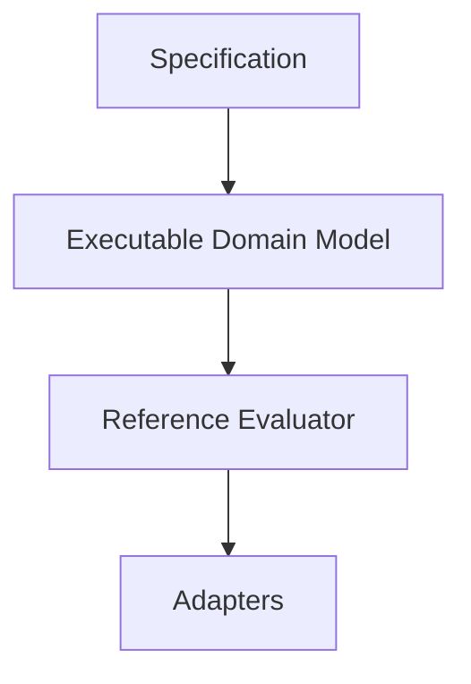
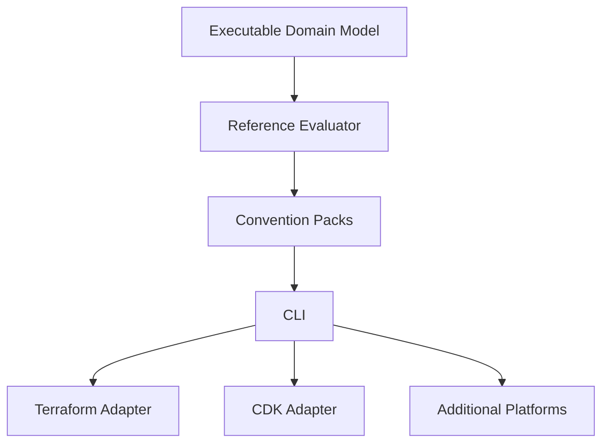

# Executable Domain Model

## Purpose

The Executable Domain Model is the canonical software representation of the Specification. Every
concept the Specification defines — Naming Request, Convention Pack, Evaluation Context, Resource
Identity, Governance Context, Resource Definition, and Convention Result (see
[`specification/README.md`](../../specification/README.md)) — will eventually have an equivalent
public TypeScript contract in this model.

The model exists so that every future consumer of the Specification in this monorepo — the
Reference Evaluator, executable Convention Packs, the CLI, and adapters — shares one common,
strongly typed vocabulary instead of each re-deriving its own representation of the same
concepts. Without it, the Reference Evaluator would have no stable contract to implement against,
and adapters would have no shared type to consume.

The model is intentionally platform independent: it has no knowledge of AWS, Azure, Kubernetes,
Terraform, CDK, Ansible, or the CLI. It contains no business logic — no naming algorithms,
validation rules, convention evaluation, hashing, or abbreviation resolution. It only describes
the *shape* of the concepts the Specification defines, not how they are evaluated or produced.
Behavior is the responsibility of the Reference Evaluator, described in
[Relationship with the Specification](#relationship-with-the-specification) below.

## Design Goals

- **Specification-driven development** — every type in the model traces back to a concept
  already documented under [`specification/`](../../specification/). Nothing is added to the
  model speculatively.
- **One-to-one mapping** — each Specification concept maps to exactly one public TypeScript
  contract, so a contributor reading the Specification can find its corresponding type without
  guessing.
- **Platform independence** — the model must remain usable by every current and future adapter
  without modification.
- **Predictable evolution** — changes to the model are classified and communicated consistently
  (see [Versioning](#versioning)), so consumers can anticipate the impact of a change.
- **Strong typing** — the model favors explicit, precise types over loose or `any`-typed shapes,
  so mistakes are caught at compile time rather than at runtime.
- **Testability** — the model's shape can be validated independently of any evaluation behavior
  (see [Testing Strategy](#testing-strategy)).
- **Backward compatibility** — the model evolves additively wherever possible, consistent with
  the compatibility rules in [`AGENTS.md`](../../AGENTS.md#compatibility-and-versioning).
- **Clear public API** — consumers have one obvious, documented entry point (see
  [Public API](#public-api)).
- **Minimal coupling** — the model depends on as little as possible, and nothing outside itself,
  so it can be reused by every adapter without pulling in unrelated concerns.

## Design Principles

- **Interfaces over classes** — Specification concepts are described as data shapes, not
  behavior. Interfaces (or equivalent type-level contracts) describe what a concept *is*;
  they do not carry methods or hidden state.
- **Immutable data structures where practical** — values produced by Context Resolution and
  Convention Evaluation represent a fact at a point in time; treating them as immutable avoids
  accidental mutation by a downstream consumer.
- **Composition over inheritance** — complex concepts (for example Resource Identity) are
  described by composing smaller, focused shapes rather than by building class hierarchies.
- **Explicit types** — every field has a precise, named type; broad or ambiguous types (`any`,
  untyped objects, loosely typed string enums) are avoided.
- **No hidden behaviour** — a type in the model never implies validation, computation, or
  side effects. If something computes a value, it belongs to the Reference Evaluator, not the
  model.
- **No runtime dependencies** — the model does not depend on any third-party runtime library. It
  is plain TypeScript types and, where unavoidable, simple, dependency-free value objects.
- **No platform-specific concepts** — no AWS, Azure, Kubernetes, Terraform, CDK, or Ansible
  vocabulary appears anywhere in the model.
- **No infrastructure concerns** — the model does not know about processes, environments,
  credentials, or deployment targets.
- **No serialization assumptions** — the model does not assume JSON, YAML, or any other wire
  format; (de)serialization is an adapter or CLI concern, not a model concern.

## Relationship with the Specification

The Specification remains the single source of truth for every concept. The Executable Domain
Model is a derived, code-level representation of it — never the reverse. If the model and the
Specification ever appear to disagree, the Specification is authoritative and the model must be
corrected to match it; the Specification must never be modified to match code (see
[`AGENTS.md`](../../AGENTS.md#specification-rules) and the Specification Freeze described in
[`.github/copilot-instructions.md`](../../.github/copilot-instructions.md#specification-freeze-v10)).



- **Specification** — the frozen conceptual model (Resource Identity, Governance Context, Naming
  Request, Context Resolution, Resource Definition, Convention Pack, Convention Result).
- **Executable Domain Model** — this document's subject: the TypeScript contracts that give the
  Specification's concepts a concrete, strongly typed shape.
- **Reference Evaluator** — the future implementation of Context Resolution and Convention
  Evaluation, built against the Executable Domain Model's contracts.
- **Adapters** — Terraform, AWS CDK, Ansible, the CLI, and future adapters that consume the
  Reference Evaluator's output through the same shared contracts.

## Model Boundaries

The model contains only the data shapes that directly represent a Specification concept, and the
shared value objects those shapes are composed from:

- Requests (the Naming Request)
- Contexts (Evaluation Context, Context Resolution inputs and outputs)
- Identities (Resource Identity)
- Governance (Governance Context)
- Definitions (Resource Definition)
- Conventions (Convention Pack)
- Results (Convention Result)
- Shared value objects used across the above (for example identifiers or small, reusable
  compound values)

The model must never contain:

- Evaluators — anything that performs Context Resolution or Convention Evaluation
- Services or builders — anything that orchestrates behavior
- Repositories or registries — anything that looks up or stores Resource Definitions or
  Convention Packs
- Cloud provider APIs — AWS, Azure, Kubernetes, or any other provider SDK
- Infrastructure tooling — Terraform, CDK, Ansible, or CLI code
- IO — filesystem, network, or environment access
- Logging
- Configuration loading

Anything in this second list belongs to the Reference Evaluator, `catalog`, the CLI, or an
adapter — never to the model itself (see [Package responsibilities in
`IMPLEMENTATION.md`](../../IMPLEMENTATION.md#package-responsibilities)).

## Package Organization

The model is proposed to live under a dedicated `model/` directory inside the existing `core`
package, alongside `core`'s existing public entry point:

```text
packages/core/src/model/
├── common/         # Shared value objects reused by more than one concept
├── requests/        # The Naming Request
├── contexts/         # Evaluation Context and Context Resolution inputs/outputs
├── identity/         # Resource Identity
├── governance/        # Governance Context
├── definitions/       # Resource Definition
├── conventions/        # Convention Pack
├── results/          # Convention Result
└── index.ts          # Re-exports the model's public surface
```

Each folder is responsible for exactly one Specification concept (or, for `common/`, the shared
value objects those concepts are composed from) and contains nothing else. `index.ts` re-exports
the intentionally public surface of every folder; it does not contain any type definitions of its
own.

This layout is a proposal, not a fixed contract: the structure may evolve as concepts are added
or reorganized, as long as the architectural principles in this document — model boundaries,
naming conventions, and dependency rules — are preserved.

## Naming Conventions

- Every Specification concept maps to exactly one public TypeScript contract; a contract is never
  split across multiple public types without a documented reason.
- Names are singular (`ResourceIdentity`, not `ResourceIdentities`), matching how the Specification
  refers to a single instance of a concept.
- Names avoid abbreviations (`GovernanceContext`, not `GovCtx`) and avoid synonyms for a concept
  the Specification already names (use the Specification's own term, not an approximation of it).
- Names use PascalCase, consistent with TypeScript type-naming conventions.
- Names are descriptive on their own, without requiring the reader to open the Specification to
  understand what a type represents.
- Each file exports exactly one primary public type, so a contributor can locate a concept's
  definition by its name alone.

These rules exist so that the mapping between the Specification and the code stays legible: a
contributor who has read the Specification should be able to predict a type's name, and its file
location, without searching.

## Dependency Rules

- Folders under `model/` may depend on `common/` and on other folders that represent a
  lower-level concept, but a lower-level concept must never depend back on a higher-level one.
  For example, `identity/` (Resource Identity) may depend on `common/`; `results/` (Convention
  Result) may depend on `identity/`, `governance/`, and `definitions/`, since a Convention Result
  is produced from those concepts — the reverse is never true.
- Circular dependencies between folders are not allowed, in either direction.
- Where a primitive value is reused across multiple concepts, it is expressed once as a shared
  value object under `common/` rather than duplicated inline in each concept that needs it.
- The model as a whole has no outbound dependency on any other package in this monorepo (see
  [Package responsibilities in `IMPLEMENTATION.md`](../../IMPLEMENTATION.md#package-responsibilities)):
  `catalog`, the CLI, and adapters depend on the model, never the other way around.

## Public API

Consumers of the model import only from the `core` package's root entry point — the same single
public entry point already described in
[`IMPLEMENTATION.md#package-api-and-exports`](../../IMPLEMENTATION.md#package-api-and-exports).
Deep imports into `model/identity/...` or any other internal folder are not part of the public
API and must not be relied upon. Because the internal folder structure is not itself a public
contract, it may be reorganized in the future — as described in [Package
Organization](#package-organization) — without breaking a consumer that only imports from the
package root.

## Versioning

Changes to the model are classified the same way as any other public API change (see
[`AGENTS.md`](../../AGENTS.md#compatibility-and-versioning)):

- **Additive** — a new concept, or a new optional field on an existing concept, that does not
  change the meaning of existing code.
- **Deprecated** — a concept or field that is still present but documented as scheduled for
  removal, giving consumers time to migrate.
- **Breaking** — a change that alters the meaning or shape of an existing public contract, for
  example removing a field, changing its type, or making an optional field required.

The Specification's own version and the Executable Domain Model's version are expected to evolve
together: a Specification change that alters a concept's shape drives the corresponding model
change, following the same evidence-driven evolution principle described in
[`specification/README.md#future-evolution`](../../specification/README.md#future-evolution).

## Testing Strategy

The model is validated for shape and structure, not behavior:

- **Contract tests** — confirm that each public type still matches the Specification concept it
  represents.
- **Export validation** — confirm that the package's public entry point exports exactly the
  intended set of types, with no accidental deep exports.
- **Architectural tests** — confirm that the dependency rules in [Dependency
  Rules](#dependency-rules) are respected (no circular dependencies, no reverse dependencies from
  a lower-level to a higher-level concept).
- **Dependency validation** — confirm the model itself has no outbound dependency on `catalog`,
  the CLI, or any adapter.
- **Type compatibility** — confirm that a proposed change is additive, deprecated, or breaking as
  intended (see [Versioning](#versioning)).

Behavior tests — verifying that Context Resolution or Convention Evaluation produce a correct
result — belong to the Reference Evaluator, not to this model.

## Non Goals

This milestone does not include:

- Naming algorithms
- Validation rules
- Convention evaluation
- Hashing
- Abbreviation resolution
- Cloud provider concepts
- Adapters
- The CLI
- Serialization
- Persistence

## Future Evolution



Each later milestone builds on the contracts defined here rather than redefining them: the
Reference Evaluator implements Context Resolution and Convention Evaluation against this model;
executable Convention Packs are authored against the same `ConventionPack` contract; the CLI and
adapters consume the Reference Evaluator's output through these shared types. See [Planned
packages in `IMPLEMENTATION.md`](../../IMPLEMENTATION.md#planned-packages) for how this maps onto
the monorepo's package boundaries.
