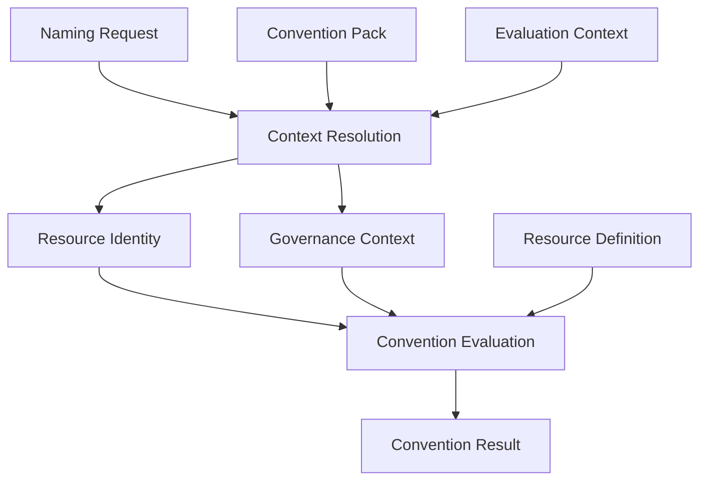

# Reference Evaluator

## Purpose

The Reference Evaluator is the canonical, executable implementation of the Specification's
evaluation semantics: Context Resolution and Convention Evaluation (see
[`specification/context-resolution.md`](../../specification/context-resolution.md) and
[`specification/convention-result.md`](../../specification/convention-result.md)). It consumes
the domain contracts defined by the
[Executable Domain Model](executable-domain-model.md) and returns a `ConventionResult`.

Like the Executable Domain Model it builds on, the Reference Evaluator remains platform
independent: it has no knowledge of AWS, Azure, Kubernetes, Terraform, CDK, Ansible, or the CLI.
It implements only the conceptual pipeline the Specification describes — nothing an adapter
would need to reimplement or reinterpret.

This document defines the architecture for Milestone 2. It does not duplicate the
Specification, and it does not implement evaluation behavior — see [Increment
plan](#increment-plan) and [Out of scope](#deferred-decisions) below for what is deferred to
later increments.

## Responsibilities

The Reference Evaluator is responsible for:

- orchestrating the two-stage evaluation pipeline the Specification defines — Context
  Resolution and Convention Evaluation (see [Evaluation pipeline](#evaluation-pipeline));
- resolving the effective Resource Identity and Governance Context from a Naming Request, a
  selected Convention Pack, and Evaluation Context;
- applying the Specification-defined source precedence, attribute authority, and protection
  rules during resolution (see
  [`specification/context-resolution.md#precedence-authority-and-protection`](../../specification/context-resolution.md#precedence-authority-and-protection));
- selecting the Resource Definition referenced by the resolved `resource_type` (a lookup, not a
  resolution — see
  [`specification/context-resolution.md#what-context-resolution-produces`](../../specification/context-resolution.md#what-context-resolution-produces));
- projecting the resolved Resource Identity and Governance Context into Convention Outputs
  (names, tags, labels, annotations), as configured by the selected Convention Pack;
- applying the convention rules the Specification and the selected Convention Pack define, once
  those rules exist in executable form (see [Increment plan](#increment-plan));
- producing a deterministic `ConventionResult`, including validation information, an
  explanation, and warnings, where the Specification defines them.

Responsibilities not described by the Specification are not assigned to the Reference
Evaluator — see [Non-responsibilities](#non-responsibilities).

## Non-responsibilities

The Reference Evaluator must never:

- read files;
- load YAML or JSON;
- discover or register Convention Packs or Resource Definitions;
- call a cloud-provider API;
- integrate with Terraform, CDK, or another IaC tool;
- parse CLI arguments;
- configure logging;
- persist data;
- consume a remote registry;
- read environment variables;
- access the network;
- transport telemetry;
- orchestrate deployments.

Everything in this list belongs to `catalog`, the CLI, or an adapter — never to `core` (see
[Package responsibilities in `IMPLEMENTATION.md`](../../IMPLEMENTATION.md#package-responsibilities)).
In particular, Convention Packs and Resource Definitions are selected by the caller (or by
`catalog`/the CLI) and handed to the evaluator as already-resolved values; the evaluator never
loads them itself.

## Inputs and outputs

The Specification describes Context Resolution and Convention Evaluation as a conceptual,
logical pipeline and explicitly states that it "does not describe implementation details such
as data structures, APIs, or execution order guarantees beyond" the conceptual steps it lists
(see
[`specification/convention-result.md#convention-evaluation-pipeline`](../../specification/convention-result.md#convention-evaluation-pipeline)).
This means the evaluator's concrete public function signature is not fully determined by the
Specification today.

Two faithful shapes are possible:

- **One aggregate input object** — a single value grouping the Naming Request, Convention
  Pack, Evaluation Context, and (once selected) Resource Definition.
- **Explicit arguments** — the evaluator accepts the Naming Request, Convention Pack,
  Evaluation Context, and Resource Definition as separate parameters, matching the four
  distinct inputs shown in the canonical pipeline diagram in
  [`specification/README.md#architecture`](../../specification/README.md#architecture).

Neither shape is finalized here. It is recorded as **deferred to the first code increment**
(see [Deferred decisions](#deferred-decisions)), to be decided with the evidence a real
implementation provides rather than guessed in advance.

The output is unambiguous: every evaluation produces a `ConventionResult` (see
[`ConventionResult`](../../packages/core/src/model/results/convention-result.ts)), already
defined by the Executable Domain Model. No new output type is introduced by this document.

## Determinism

Context Resolution and Convention Evaluation must both be deterministic: the same complete
inputs must always produce the same `ConventionResult` (see
[`specification/context-resolution.md#deterministic-behaviour`](../../specification/context-resolution.md#deterministic-behaviour)).
This is a precondition for meaningful contract and compatibility testing across adapters.

The evaluator must not depend on:

- the current time;
- random values;
- the process environment;
- filesystem state;
- network state;
- a cloud provider API;
- mutable global state.

Any normalization, truncation, hashing, or collision-handling behavior introduced by a later
increment must also be deterministic — a given input must never produce different outputs on
different runs.

## Evaluation pipeline

The Specification defines exactly two processing stages — Context Resolution and Convention
Evaluation — with Resource Definition selection as an intermediate lookup between them (see
[`specification/README.md#architecture`](../../specification/README.md#architecture)):



At an architectural level:

| Stage | Input | Output | Responsibility | Must not |
| --- | --- | --- | --- | --- |
| Context Resolution | `NamingRequest`, `ConventionPack`, `EvaluationContext` | `ResourceIdentity`, `GovernanceContext` | Apply the Specification's resolution precedence, attribute authority, and protection rules to produce both canonical models together (see [`specification/context-resolution.md`](../../specification/context-resolution.md)) | Generate names, tags, labels, or annotations; select a Resource Definition |
| Resource Definition selection | The resolved `functional.resource_type` | `ResourceDefinition` | Look up the Resource Definition referenced by the resolved resource type | Load a catalog, file, or registry from within `core`; resolve or infer a resource type |
| Convention Evaluation | `ResourceIdentity`, `GovernanceContext`, `ResourceDefinition`, the selected `ConventionPack` | `ConventionResult` | Project identity and governance into Convention Outputs, then validate those outputs and the resolved identity against the Resource Definition's constraints and the Specification, producing warnings and an explanation | Re-resolve context; bypass Resource Definition constraints; invent a validation rule the Specification does not define |

Context Resolution produces Resource Identity and Governance Context **together**, not as two
sequential sub-stages — the Specification describes them as the two outputs of one process, and
several precedence-order entries (for example Governance Profile defaults) interleave with
identity-related sources in the same ordered list (see
[`specification/context-resolution.md#resolution-precedence`](../../specification/context-resolution.md#resolution-precedence)).
This document intentionally does not describe algorithm-level detail (for example, exactly how
each precedence rule is implemented) — that belongs to the increment that implements it.

## Dependency boundaries

An illustrative internal structure, mirroring the Executable Domain Model's package layout
(see
[Package Organization in `executable-domain-model.md`](executable-domain-model.md#package-organization)):

```text
packages/core/src/
    model/
    evaluator/
        context-resolution/        # Resource Identity + Governance Context (increment 2.2)
        resource-definition/       # selection boundary (increment 2.3)
        convention-evaluation/     # projection, output generation, validation (2.4, 2.5)
        index.ts
```

This is illustrative, not a commitment: folders are created only when the increment that needs
them begins (see [Code scaffold](#code-scaffold) below — none exist yet).

Dependency direction:

```text
model
  ↑
evaluator stage contracts
  ↑
evaluator orchestration
```

- The evaluator may depend on the model.
- The model must never depend on the evaluator.
- Evaluator stages must not depend on adapters, the CLI, provider SDKs, or filesystem code.

## Functional core

Evaluator logic should be implemented as pure functions where practical: explicit inputs,
explicit outputs, immutable transformations, deterministic behavior, and small composable
stages, consistent with the Executable Domain Model's own preference for immutable data (see
[Design Principles in `executable-domain-model.md`](executable-domain-model.md#design-principles)).

Avoid, by default:

- service locators;
- dependency injection frameworks;
- mutable evaluator classes;
- hidden caches;
- singletons;
- process-global configuration.

This is a default, not a categorical prohibition: a class may be justified later by concrete
evidence (for example, genuinely stateful memoization within a single evaluation), but pure
functions are the starting assumption for every increment below.

## Validation and diagnostics

The Specification distinguishes several kinds of outcome that must not be conflated:

- **Input shape validation** — whether a `NamingRequest` (or other input) matches its JSON
  Schema. This is a schema-level concern, already tracked as validation layer 2 in
  [`IMPLEMENTATION.md#validation-strategy`](../../IMPLEMENTATION.md#validation-strategy); it is
  not part of Context Resolution or Convention Evaluation themselves.
- **Normative domain validation** — whether a resolved value may replace another given the
  Specification's authority and protection rules (see
  [`specification/context-resolution.md#precedence-authority-and-protection`](../../specification/context-resolution.md#precedence-authority-and-protection)).
  This happens during Context Resolution.
- **Convention validation** — whether generated outputs and the resolved Resource Identity
  satisfy the Resource Definition's constraints and the Specification (uniqueness,
  normalization, Placement Constraints); this is `ConventionResult.validation` (see
  [`specification/convention-result.md#conceptual-contents`](../../specification/convention-result.md#conceptual-contents)).
- **Diagnostics** — `ConventionResult.explanation` and `ConventionResult.warnings`, both
  already modeled by the Executable Domain Model.

The Convention Evaluation pipeline reaches its final step, "Produce Convention Result," even
when validation fails (see [Convention Evaluation
pipeline](../../specification/convention-result.md#convention-evaluation-pipeline) in the
Specification) — `ConventionResult.validation.valid` is the signal, not an exception. This
document records, as
the working assumption for later increments, that **expected evaluation outcomes** — a failed
constraint, an unresolved non-required attribute, a value that had to be normalized — should be
represented in `ConventionResult` rather than thrown. Unexpected programmer errors (for example,
a malformed internal invariant) may remain exceptional, but no exception hierarchy is designed
here (see [Deferred decisions](#deferred-decisions) for the one genuinely open question: what
happens when a *required* attribute, per the selected Convention Pack's
`required_attributes`, cannot be resolved at all).

No runtime schema library (AJV, Zod, or similar) is selected in this document — that remains a
deferred decision already tracked in
[`IMPLEMENTATION.md#deferred-decisions`](../../IMPLEMENTATION.md#deferred-decisions).

## Traceability and explanation

`ConventionResult.explanation` and `ConventionResult.warnings` require the pipeline to retain
enough information, as it runs, to describe how a result was derived (see
[`specification/convention-result.md#conceptual-contents`](../../specification/convention-result.md#conceptual-contents)).
Later increments that implement Context Resolution and Convention Evaluation should design each
stage so it can report which source supplied a given attribute and why, rather than only
producing a final value — but no tracing mechanism is implemented by this document. Generic
application logging is not a substitute for this domain-level trace data: an explanation is a
Convention Result field, not a log line, and must remain deterministic and reproducible from the
same inputs.

## Public API principles

The future evaluator's public API should follow the same principles already established for
the Executable Domain Model (see [Public API in
`executable-domain-model.md`](executable-domain-model.md#public-api)):

- importable from the package root only, no deep imports;
- an explicit, documented input contract (shape to be finalized per [Inputs and
  outputs](#inputs-and-outputs));
- a deterministic output (`ConventionResult`);
- no provider-specific parameters;
- no IO side effects;
- stable public types, evolved additively wherever possible;
- internal evaluator stages (Context Resolution, Resource Definition selection, Convention
  Evaluation) are implementation details, not public API surface, unless a concrete consumer
  need justifies exposing one independently.

## Testing strategy

Once evaluation behavior exists, the following test categories are planned:

- **Specification examples as acceptance tests** — concrete examples already described in the
  Specification (for example,
  [`specification/resource-definition.md#illustrative-examples`](../../specification/resource-definition.md#illustrative-examples))
  used as end-to-end fixtures.
- **Unit tests for each pure stage** — Context Resolution, Resource Definition selection, and
  Convention Evaluation tested independently.
- **Table-driven precedence tests** — covering the seven-level precedence order and the
  authority/protection exceptions to it (see
  [`specification/context-resolution.md#resolution-precedence`](../../specification/context-resolution.md#resolution-precedence)).
- **Invariant tests** — for example, a `ConventionResult` always has a `resource_identity`, a
  `governance_context`, `outputs`, and a `validation`, regardless of outcome.
- **Deterministic-output tests** — the same inputs evaluated twice produce identical results.
- **Compile-time public API tests** — following the same pattern as
  [`packages/core/test/types/contract-fixtures.ts`](../../packages/core/test/types/contract-fixtures.ts).
- **Regression tests** for resolved edge cases, added as they are discovered.

No new test runner or testing dependency is introduced — Node's built-in test runner
(`node:test`), already used by `core`, remains sufficient (see
[Testing and fixture strategy in `IMPLEMENTATION.md`](../../IMPLEMENTATION.md#testing-and-fixture-strategy)).
These tests are not implemented by this document — see [Code scaffold](#code-scaffold).

## Increment plan

Milestone 2 is delivered as a sequence of small increments. The recommended structure in this
task's prompt proposed splitting "Context resolution" and "Governance and convention
resolution" into separate increments; this document merges them into a single increment 2.2,
because the Specification defines Resource Identity and Governance Context as the two outputs
of one Context Resolution process, not two sequential resolutions (see [Evaluation
pipeline](#evaluation-pipeline) above). "Resource projection" is likewise renamed to match the
Specification's own terms ("Evaluate Convention" / "Generate outputs").

- **2.1 — Evaluator architecture and public contract** (this document, plus the pipeline
  contracts below). Defines responsibility, inputs/outputs, determinism, dependency
  boundaries, and error philosophy at a conceptual level, and implements the behavior-free
  internal contracts between evaluator stages (see [Pipeline contracts
  (implemented)](#pipeline-contracts-implemented)). No behavior. **Definition of done:** this
  document exists, is linked from `IMPLEMENTATION.md`, `packages/core/src/evaluator/contracts/`
  defines `ContextResolutionInput`, `ContextResolutionResult`, and `ConventionEvaluationInput`,
  and no evaluation behavior has been implemented. **Status: complete.**
- **2.2 — Context Resolution (Resource Identity and Governance Context)**. Implements the
  normative resolution of Resource Identity and Governance Context from a Naming Request,
  Convention Pack, and Evaluation Context: source precedence, attribute authority, protection,
  and derived-attribute (fallback) handling. No naming projection. **Definition of done:**
  given a Naming Request, Convention Pack, and Evaluation Context, the evaluator produces a
  complete, correctly-ordered `ResourceIdentity` and `GovernanceContext`, verified by
  table-driven precedence tests.
- **2.3 — Resource Definition selection**. Establishes the boundary where `core` accepts an
  already-selected `ResourceDefinition` (matching the resolved `resource_type`) as an
  evaluator input, without loading it itself. **Definition of done:** the evaluator's input
  contract accepts a `ResourceDefinition`; no file, registry, or catalog access exists in
  `core`.
- **2.4 — Convention Evaluation: projection and output generation**. Applies the selected
  Convention Pack's naming component order, abbreviations, and metadata projection to the
  resolved Resource Identity and Governance Context, producing `ConventionOutputs`.
  **Definition of done:** given a resolved identity, governance context, and Convention Pack,
  the evaluator produces a name and metadata consistent with the Convention Pack's declared
  ordering and abbreviations.
- **2.5 — Convention Evaluation: validation and Convention Result production**. Validates the
  generated outputs and resolved identity against the Resource Definition's constraints and the
  Specification, collects warnings, and assembles the final `ConventionResult`. **Definition of
  done:** the evaluator returns a complete `ConventionResult` whose `validation.valid` correctly
  reflects constraint violations, for both valid and invalid inputs.

## Pipeline contracts (implemented)

Milestone 2.1 implements the behavior-free internal contracts that make the stage
boundaries described in [Evaluation pipeline](#evaluation-pipeline) explicit in code, under
[`packages/core/src/evaluator/contracts/`](../../packages/core/src/evaluator/contracts/). No
Context Resolution, Resource Definition selection, or Convention Evaluation behavior exists —
these are types only.

| Contract | Composes | Produced by | Consumed by | Visibility |
| --- | --- | --- | --- | --- |
| `ContextResolutionInput` | `NamingRequest`, `ConventionPack`, `EvaluationContext` | The caller of Context Resolution (increment 2.2) | Context Resolution (increment 2.2) | Internal |
| `ContextResolutionResult` | `ResourceIdentity`, `GovernanceContext` | Context Resolution (increment 2.2) | Resource Definition selection (2.3); Convention Evaluation (2.4–2.5), via `ConventionEvaluationInput` | Internal |
| `ConventionEvaluationInput` | `ContextResolutionResult`, `ResourceDefinition`, `ConventionPack` | The caller of Convention Evaluation, once Resource Definition selection (2.3) has run | Convention Evaluation (increments 2.4–2.5) | Internal |

Each is required-field-only (unlike the domain contracts it composes, whose own attributes stay
optional to mirror their permissive JSON Schemas): a stage-boundary contract represents "this
stage has everything it needs," which is a stronger, evaluator-specific invariant the domain
model does not itself express. All three remain internal — none are re-exported from the
package root (`packages/core/src/index.ts`) — because the public `evaluate()` signature is
still an open decision (see [Deferred decisions](#deferred-decisions)), and no consumer outside
the evaluator's own orchestration needs to inspect them yet (see [Public API
principles](#public-api-principles)). They are exported only from
[`packages/core/src/evaluator/index.ts`](../../packages/core/src/evaluator/index.ts), the
evaluator's own internal module boundary.

### Contracts considered and rejected

- **A separate "resolved governance" contract, sequential to a "resolved identity" contract** —
  rejected. The Specification states Context Resolution produces Resource Identity and
  Governance Context together, as the two outputs of one process, not as two independent or
  sequential resolutions (see
  [`specification/context-resolution.md#what-context-resolution-produces`](../../specification/context-resolution.md#what-context-resolution-produces)).
  Splitting them into two contracts would invent a sequencing the Specification does not
  describe; `ContextResolutionResult` represents both together instead.
- **A "resolved convention set" wrapping the selected Resource Definition and Convention Pack
  alone** — rejected. Resource Definition selection is "a lookup, not a resolution" (see
  [`specification/context-resolution.md#what-context-resolution-produces`](../../specification/context-resolution.md#what-context-resolution-produces)),
  and a Convention Pack is not itself resolved into a new shape — it is selected upfront and
  used as-is. Bundling only these two, without the resolved identity and governance Convention
  Evaluation also needs, would not represent the actual stage-2 boundary; `ConventionEvaluationInput`
  bundles all three together instead.
- **A "projected resource" contract for generated-but-unvalidated outputs** — rejected. The
  existing `ConventionOutputs` domain contract (see
  [`ConventionResult`](../../packages/core/src/model/results/convention-result.ts)) already
  represents exactly this value — it is already used as an independent field, separate from
  `ConventionValidation`, inside `ConventionResult`. A new type here would duplicate an existing
  domain contract rather than compose it.
- **An "evaluated convention" contract for the fully-validated result, distinct from
  `ConventionResult`** — rejected for the same reason: `ConventionResult` already is the
  Specification's own name for this final artifact (see
  [`specification/convention-result.md`](../../specification/convention-result.md)); introducing
  a second name for the same shape would duplicate an existing domain contract.
- **A single contract bundling the entire pipeline end to end** (an `EvaluationInput`-style
  aggregate matching a possible public `evaluate()` signature) — rejected for this increment.
  This is exactly the still-open public function signature question recorded in [Inputs and
  outputs](#inputs-and-outputs); inventing it now would fabricate a public contract this
  document cannot yet honor truthfully.

## Code scaffold

`packages/core/src/evaluator/` now exists, containing only the pipeline contracts above — no
stage implementation, resolver function, or the public `evaluate()` function. Only
`contracts/` was created under `evaluator/`; no empty folders were created for the
`context-resolution/`, `resource-definition/`, or `convention-evaluation/` stages illustrated
in [Dependency boundaries](#dependency-boundaries) — those are created only when the increment
that implements them begins.

## Deferred decisions

- **Final evaluator function signature** — aggregate input object versus explicit arguments
  (see [Inputs and outputs](#inputs-and-outputs)). The 2.1 pipeline contracts fix the internal
  stage boundaries but deliberately do not answer this question — none of them are exported
  from the package root. To be decided in increment 2.2 or later, whichever needs it first.
- **Internal error representation** — no exception hierarchy is designed yet; only the working
  assumption that expected evaluation outcomes belong in `ConventionResult` (see [Validation
  and diagnostics](#validation-and-diagnostics)).
- **Required-but-unresolvable attribute handling** — the Specification requires a Convention
  Pack's `required_attributes` to be available "before Convention Evaluation can proceed" (see
  [`specification/convention-pack.md#required-attributes`](../../specification/convention-pack.md#required-attributes)),
  but does not state whether that condition failing should surface as a `ConventionResult`
  with `validation.valid: false`, or should prevent Convention Evaluation — and therefore a
  `ConventionResult` — from being produced at all. Deferred to increment 2.2.
- **Whether input runtime validation belongs in `core` or at an integration boundary** — no
  runtime schema library is selected (already tracked in
  [`IMPLEMENTATION.md#deferred-decisions`](../../IMPLEMENTATION.md#deferred-decisions)).
- **Exact stage boundaries within Convention Evaluation** — the Specification permits more than
  one faithful split between "generate outputs" and "validate outputs" (for example, whether
  normalization happens before or interleaved with generation); increments 2.4 and 2.5 above
  reflect one faithful reading, not the only one.
