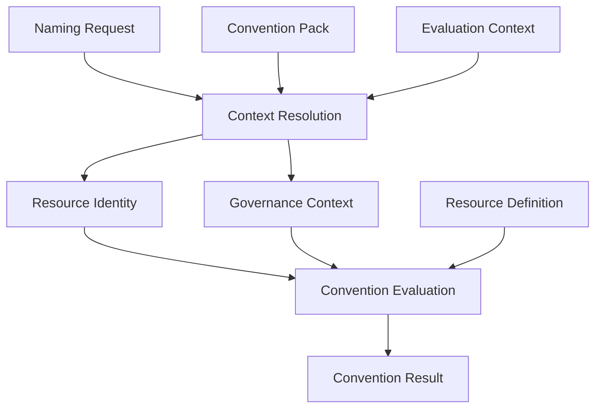

# Specification

This directory contains the Specification for `iac-resource-conventions`.

## Specification Status

**Current version:** Specification v1.0
**Status:** Frozen

The conceptual Specification described in this directory — Resource Identity,
Governance Context, Naming Request, Context Resolution, Resource Definition, Convention
Pack, and Convention Result — is now considered stable. Future conceptual changes
should only be introduced when real implementation experience demonstrates that the
current model is insufficient.

The Reference Evaluator, Resource Definitions, Convention Packs, and adapters are
expected to validate this Specification rather than redefine it. (The Reference
Evaluator is the reference implementation of Convention Evaluation; this document also
refers to it as the Convention Engine — see [Architecture](#architecture) below.)

"Frozen" does not mean immutable: future evolution is still allowed when justified by
implementation evidence (see [Future evolution](#future-evolution) below).

## Purpose

The Specification defines the conventions for Infrastructure as Code (IaC) resources —
naming, identity, governance context, tags, labels, annotations, metadata, and
validation — independently of any cloud provider, tool, or programming language. It
exists so that conventions are defined once, in one place, using a shared vocabulary,
rather than being reinvented or reinterpreted by each tool that needs to apply them.

## Design Principles

The Specification is built around a small set of architectural principles:

- Specification First
- Implementation-independent concepts
- Canonical resource identity
- Separation of identity, governance, resource definition, and convention policy
- Evidence-driven evolution
- Cross-tool interoperability

## The Specification is the single source of truth

Every concept an adapter relies on — identity, governance context, naming, tagging,
validation — is defined here first. If a rule is not defined in the Specification, it
does not yet exist as a project convention. Adapters do not introduce new conventions;
they render the conventions defined in the Specification into a form appropriate for
their platform.

## Adapters consume the Specification

Terraform, AWS CDK, Ansible, the CLI, and any future adapter are consumers of the
Specification. Each adapter reads and interprets the concepts and rules described here to
produce results appropriate to its own tooling. Because every adapter draws from the same
Specification, resources produced by different adapters remain consistent with one
another for the same canonical input.

## What belongs here

- Independent conceptual and domain models — Resource Identity (what a resource is),
  Governance Context (how a resource is owned and governed), Resource Definition (the
  technical rules for a kind of resource), and Convention Pack (how canonical models are
  projected into platform-specific conventions) are modeled as separate, independent
  concepts.
- Public request/response contracts (for example, the Naming Request and the Convention
  Result).
- The conceptual model of how these pieces are combined (Context Resolution) and
  evaluated (Convention Evaluation).
- JSON Schemas describing the structure of the models that already have one.
- Concrete Specification Artifacts that apply a Concept to a specific organizational
  policy, written as Markdown policy documents (for example, the concrete Convention
  Packs under [`convention-packs/`](./convention-packs/)). See **Concepts and
  Specification Artifacts** below.
- Reusable convention dimension Concepts that an effective Convention Pack may compose —
  Platform Convention, Organization Convention, and Deployment Convention — documented under
  [`policies/`](./policies/).

## What does not belong here

- Terraform, AWS CDK, Ansible, or CLI code.
- Tool-specific syntax or rendering logic.
- Cloud-provider-specific implementation details.
- YAML, JSON, or generated representations of a Convention Pack; Resource Definitions
  catalog entries; or Context Providers — these are configuration and implementation
  concerns that consume the Specification's concepts, not part of the conceptual
  Specification itself.

Those concerns belong to adapters, which are introduced in later iterations of this
project.

## Concepts and Specification Artifacts

The Specification now contains two kinds of content:

- **Concepts** — the abstract, reusable domain models documented directly under
  `specification/` (for example, Resource Identity, Governance Context, Naming Request,
  Context Resolution, Resource Definition, the abstract Convention Pack concept, and
  Convention Result). A Concept answers a general question that applies to every
  organization adopting the Specification, independently of any specific organizational
  policy.
- **Specification Artifacts** — concrete instances that apply a Concept to a specific
  organizational policy. The first Specification Artifacts are the concrete Convention
  Packs under [`convention-packs/`](./convention-packs/), starting with
  [`convention-packs/aws-workload-default.md`](./convention-packs/aws-workload-default.md).
  A Specification Artifact applies a Concept; it does not redefine it. See
  [`convention-packs/README.md`](./convention-packs/README.md) for the full
  distinction.

Concrete Convention Packs remain Markdown policy documents in this iteration of the
Specification. YAML, JSON, or generated representations of a Convention Pack are not
yet defined (see **What does not belong here** above).

## Contents

The Specification currently consists of the following Concepts and Specification
Artifacts:

- [`resource-identity.md`](./resource-identity.md) — the canonical domain model for
  identifying a resource: what it is.
- [`governance-context.md`](./governance-context.md) — the canonical domain model for
  how a resource is owned and governed.
- [`naming-request.md`](./naming-request.md) — the public request contract used to
  produce a Resource Identity and Governance Context.
- [`context-resolution.md`](./context-resolution.md) — how a Naming Request is resolved,
  with a Convention Pack and shared context, into Resource Identity and Governance
  Context.
- [`resource-definition.md`](./resource-definition.md) — the technical characteristics
  and constraints of a canonical resource type.
- [`convention-pack.md`](./convention-pack.md) — the Specification artifact that
  defines how canonical models are projected into platform-specific conventions, and
  how an effective Convention Pack may compose reusable Platform Convention, Organization
  Convention, and Deployment Convention dimensions.
- [`policies/`](./policies/) — the reusable convention dimension Concepts — Platform
  Convention, Organization Convention, and Deployment Convention — that an effective
  Convention Pack may compose.
- [`convention-packs/`](./convention-packs/) — concrete Convention Packs that apply the
  Convention Pack concept to a specific organizational policy.
- [`convention-result.md`](./convention-result.md) — the conceptual output produced by
  Convention Evaluation.
- [`schemas/`](./schemas/) — JSON Schema definitions for the models described above that
  already have one.

## Architecture

These documents describe independent concepts that are combined into a single
conceptual pipeline:

- **Naming Request** — the minimal, user-supplied description of the resource being
  requested (see [`naming-request.md`](./naming-request.md)).
- **Convention Pack** — a Specification artifact, selected via the request's
  `convention` field, that defines how canonical models are projected into
  platform-specific conventions: naming defaults, deployment defaults, governance
  defaults, abbreviations, ordering rules, metadata projection, and override policy (see
  [`convention-pack.md`](./convention-pack.md)). An effective Convention Pack may be
  assembled from reusable Platform Convention, Organization Convention, and Deployment
  Convention dimensions (see [`policies/`](./policies/)), but it remains the single
  artifact selected via `convention`. Convention Packs are currently defined as
  conceptual Markdown Specification Artifacts; machine-readable or executable
  representations are intentionally out of scope for this iteration (see **What does
  not belong here** above).
- **Evaluation Context** — the complete set of external facts available during a
  specific evaluation, including shared organizational context, shared deployment
  context, Runtime Context, and Provisioning Context (see
  [`context-resolution.md`](./context-resolution.md#evaluation-context)). It is not part
  of the Convention Pack.
- **Context Resolution** — the process that combines the Naming Request, the Convention
  Pack, and Evaluation Context into complete canonical models. Context Resolution only
  produces canonical models; it does not generate names, tags, labels, annotations, or
  other platform-specific outputs — those belong to Convention Evaluation (see
  [`context-resolution.md`](./context-resolution.md)).
- **Resource Identity** — the canonical, three-plane model describing what the resource
  is (see [`resource-identity.md`](./resource-identity.md)).
- **Governance Context** — the canonical model describing who owns, pays for, and
  manages the resource (see [`governance-context.md`](./governance-context.md)).
- **Resource Definition** — the technical characteristics and constraints of the
  resource's canonical resource type; it is selected (looked up) from the resolved
  `resource_type` once Resource Identity is complete, and participates in Convention
  Evaluation as an input (see [`resource-definition.md`](./resource-definition.md)).
- **Convention Evaluation** — evaluates the Specification against Resource Identity,
  Governance Context, and the resource's Resource Definition to produce
  platform-specific outputs. This is the Specification responsibility that generates
  names, tags, labels, and annotations; a future software component that implements it
  may be called the Convention Engine.
- **Convention Result** — the final output returned to the caller (see
  [`convention-result.md`](./convention-result.md)).

The pipeline has exactly two processing stages: Context Resolution and Convention
Evaluation. The Naming Request, Convention Pack, Evaluation Context, Resource Identity,
Governance Context, Resource Definition, and Convention Result are domain models or
Specification artifacts consumed or produced by those two stages — not processing
stages themselves. Convention Pack, the Naming Request, and Evaluation Context are all
inputs to Context Resolution; Resource Definition is an input to Convention
Evaluation, selected by `resource_type` once Resource Identity is complete — Context
Resolution does not resolve the Resource Definition. Composing an effective Convention
Pack from Platform Convention, Organization Convention, and Deployment Convention (see
[`convention-pack.md`](./convention-pack.md#composed-from-reusable-convention-dimensions))
is a Specification Artifact concern, not a third processing stage; likewise, external
provisioning systems and IaC that produce Provisioning Context are outside this pipeline
(see [`context-resolution.md`](./context-resolution.md#business-to-infrastructure-boundary)).

If a document only focuses on one part of this pipeline, it uses a simplified diagram
showing just the concepts relevant to it. Every diagram in the Specification is expected
to be consistent with the canonical pipeline shown above.

## Schema identifiers

During this pre-1.0 phase, JSON Schema `$id` values use the canonical raw GitHub location
on the default branch (for example,
`https://raw.githubusercontent.com/lksnext/iac-resource-conventions/main/specification/schemas/resource-identity.schema.json`).
These URIs are not yet immutable release contracts; they may be revisited once the
project adopts versioned schema releases.

## Future evolution

The conceptual Specification is frozen as v1.0, but it is expected to evolve over time.
Future changes should follow these principles:

- **Implementation first** — build the Reference Evaluator, a Resource Definition
  catalog, executable Convention Packs, and adapters before revisiting conceptual
  models.
- **Evidence over speculation** — only propose a conceptual change when real
  implementation work demonstrates the current model cannot represent a valid
  scenario, not because a theoretical improvement seems plausible.
- **Backward compatibility whenever possible** — prefer additive, non-breaking changes
  to existing concepts, schemas, and Specification Artifacts.
- **Semantic versioning** — conceptual changes that break compatibility require a new
  major Specification version (see
  [`AGENTS.md`](../AGENTS.md#compatibility-and-versioning)).
- **No conceptual changes without demonstrated need** — do not redesign a Concept
  documented here unless implementation evidence justifies it.
