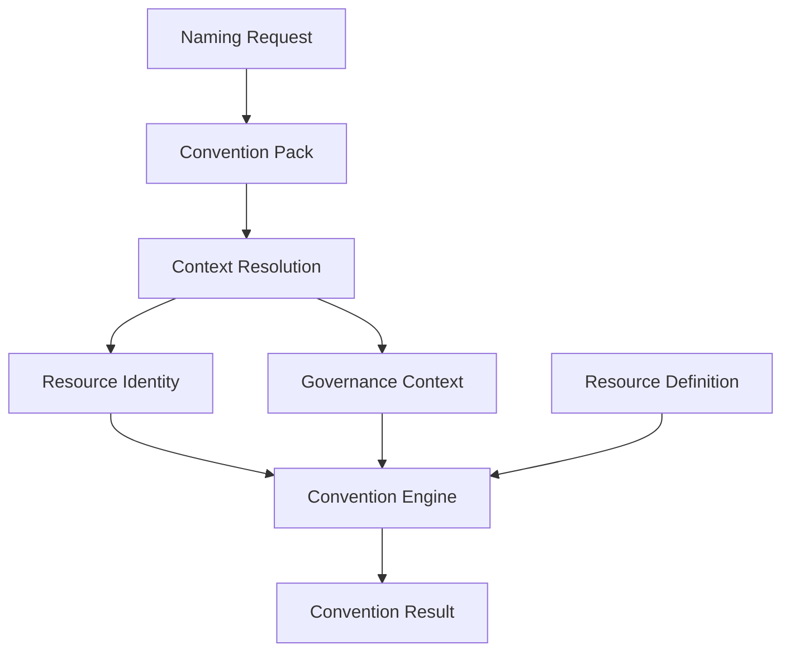

# Specification

This directory contains the Specification for `iac-resource-conventions`.

## Purpose

The Specification defines the conventions for Infrastructure as Code (IaC) resources —
naming, identity, governance context, tags, labels, annotations, metadata, and
validation — independently of any cloud provider, tool, or programming language. It
exists so that conventions are defined once, in one place, using a shared vocabulary,
rather than being reinvented or reinterpreted by each tool that needs to apply them.

## The Specification is the single source of truth

Every concept an adapter relies on — identity, governance context, naming, tagging,
validation — is defined here first. If a rule is not defined in the Specification, it
does not yet exist as a project convention. Adapters do not introduce new conventions;
they render the conventions defined in the Specification into a form appropriate for
their platform.

## Adapters consume the Specification

Terraform, AWS CDK, Ansible, the CLI, and any future adapter are consumers of the
Specification. Each adapter reads and interprets the concepts and rules described here to
produce results appropriate to its own tooling. Because every adapter draws from the same
Specification, resources produced by different adapters remain consistent with one
another for the same canonical input.

## What belongs here

- Independent conceptual and domain models — Resource Identity (what a resource is),
  Governance Context (how a resource is owned and governed), and Resource Definition
  (the technical rules for a kind of resource) are modeled as separate, independent
  concepts.
- Public request/response contracts (for example, the Naming Request and the Convention
  Result).
- The conceptual model of how these pieces are combined (Context Resolution) and
  evaluated (the Convention Engine).
- JSON Schemas describing the structure of the models that already have one.

## What does not belong here

- Terraform, AWS CDK, Ansible, or CLI code.
- Tool-specific syntax or rendering logic.
- Cloud-provider-specific implementation details.
- Convention Packs, Resource Definitions catalog entries, or Context Providers — these
  are configuration and implementation concerns that consume the Specification, not
  part of the conceptual Specification itself.

Those concerns belong to adapters, which are introduced in later iterations of this
project.

## Contents

The Specification currently consists of the following conceptual documents:

- [`resource-identity.md`](./resource-identity.md) — the canonical domain model for
  identifying a resource: what it is.
- [`governance-context.md`](./governance-context.md) — the canonical domain model for
  how a resource is owned and governed.
- [`naming-request.md`](./naming-request.md) — the public request contract used to
  produce a Resource Identity and Governance Context.
- [`context-resolution.md`](./context-resolution.md) — how a Naming Request is resolved,
  with a Convention Pack and shared context, into Resource Identity and Governance
  Context.
- [`resource-definition.md`](./resource-definition.md) — the technical characteristics
  and constraints of a canonical resource type.
- [`convention-result.md`](./convention-result.md) — the conceptual output produced by
  the Convention Engine.
- [`schemas/`](./schemas/) — JSON Schema definitions for the models described above that
  already have one.

## Architecture

These documents describe independent concepts that are combined into a single
conceptual pipeline:

- **Naming Request** — the minimal, user-supplied description of the resource being
  requested (see [`naming-request.md`](./naming-request.md)).
- **Convention Pack** — configuration, selected via the request's `convention` field,
  that supplies naming, deployment, and governance defaults. Convention Packs are not
  yet implemented in this Specification (see **What does not belong here** above).
- **Context Resolution** — the process that combines the Naming Request, the Convention
  Pack, and shared context into complete canonical models (see
  [`context-resolution.md`](./context-resolution.md)).
- **Resource Identity** — the canonical, three-plane model describing what the resource
  is (see [`resource-identity.md`](./resource-identity.md)).
- **Governance Context** — the canonical model describing who owns, pays for, and
  manages the resource (see [`governance-context.md`](./governance-context.md)).
- **Resource Definition** — the technical characteristics and constraints of the
  resource's canonical resource type (see
  [`resource-definition.md`](./resource-definition.md)).
- **Convention Engine** — evaluates the Specification against Resource Identity,
  Governance Context, and the resource's Resource Definition to produce a result. The
  Convention Engine itself is an implementation concern; the Specification only defines
  what it consumes and produces.
- **Convention Result** — the final output returned to the caller (see
  [`convention-result.md`](./convention-result.md)).

If a document only focuses on one part of this pipeline, it uses a simplified diagram
showing just the concepts relevant to it. Every diagram in the Specification is expected
to be consistent with the canonical pipeline shown above.

## Schema identifiers

During this pre-1.0 phase, JSON Schema `$id` values use the canonical raw GitHub location
on the default branch (for example,
`https://raw.githubusercontent.com/lksnext/iac-resource-conventions/main/specification/schemas/resource-identity.schema.json`).
These URIs are not yet immutable release contracts; they may be revisited once the
project adopts versioned schema releases.
