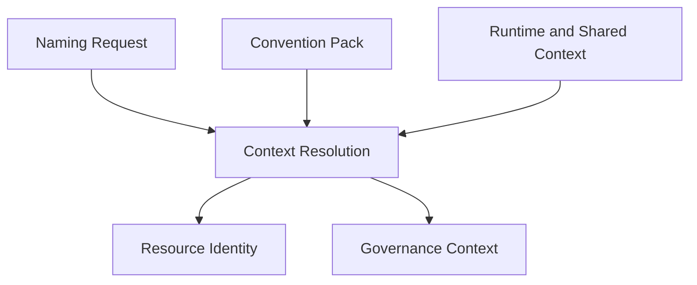

# Context Resolution

Context Resolution is the conceptual process that turns a minimal
[Naming Request](./naming-request.md) into the two canonical models every adapter
consumes: [Resource Identity](./resource-identity.md) and
[Governance Context](./governance-context.md). It is the mechanism, not a model itself —
it does not introduce new attributes; it explains how the attributes defined elsewhere
are combined and completed.

Context Resolution only produces canonical models. It does not generate names, tags,
labels, annotations, or other platform-specific outputs — those belong to Convention
Evaluation (see [`convention-result.md`](./convention-result.md)).

## Purpose

A caller supplies only the information that is specific to a single resource. Context
Resolution supplies everything else: organizational placement, deployment context, and
governance defaults that would otherwise have to be repeated on every request. Its
purpose is to produce a complete, deterministic Resource Identity and Governance Context
from a small, focused request.

## Resolution sources

Context Resolution combines information from several sources:

- **Naming Request** — the caller-supplied values specific to the resource being named
  (see [`naming-request.md`](./naming-request.md)).
- **Convention Pack** — selected explicitly via the request's `convention` field;
  supplies naming defaults, deployment defaults, governance defaults (including an
  optional default Governance Profile), and metadata projection rules (see
  [`convention-pack.md`](./convention-pack.md)).
- **Shared organizational context** — organizational values that are stable across many
  requests (for example, `organization`, `business_unit`) and do not need to be repeated
  by the caller.
- **Shared deployment context** — deployment values that are resolved from the
  environment in which the request is made (for example, `platform`, `deployment_scope`).
- **Governance Profile defaults** — governance defaults declared by the selected
  Governance Profile (see [`governance-context.md`](./governance-context.md)).
- **Runtime or provisioning context** — dynamic facts associated with one execution,
  tenant, or provisioned deployment scope, potentially supplied or enriched by a
  provisioning process (see
  [Runtime Context and Provisioning Context](#runtime-context-and-provisioning-context)
  below).
- **Validated explicit overrides** — values supplied in the request's `overrides` block
  (see [Overrides](#overrides) below).

## Resolution precedence

Context Resolution applies these sources in a fixed order, from lowest to highest
precedence:

1. **Convention Pack defaults** — naming, deployment, and metadata defaults declared by
   the selected Convention Pack. These are the broadest defaults and apply first.
2. **Shared Organizational Context** — organizational values resolved from shared
   context. These override Convention Pack defaults because they reflect the actual
   organizational placement of the resource.
3. **Shared Deployment Context** — deployment values resolved from shared context. These
   override both prior layers because they reflect where the resource is actually being
   deployed.
4. **Runtime or provisioning context** — dynamic facts associated with this execution,
   tenant, or provisioned deployment scope. These override shared context because they
   are specific to this evaluation rather than broadly shared, but some of their values
   may additionally be *protected* (see
   [Precedence versus protection](#precedence-versus-protection) below).
5. **Governance Profile defaults** — governance defaults declared by the selected
   Governance Profile. These apply after identity-related context because governance is
   resolved independently of deployment and organizational placement.
6. **Naming Request values** — values explicitly supplied by the caller in the Naming
   Request. A caller-supplied value always takes precedence over any default, unless the
   value it would replace is protected.
7. **Validated explicit overrides** — values supplied in the request's `overrides`
   block. These are the most specific, deliberate values a caller can provide and
   normally win over non-protected values, but they are still validated during
   Convention Evaluation (see [Overrides](#overrides) below).

Precedence determines which source wins when more than one source supplies the same
attribute. It does not, by itself, determine whether a caller is allowed to replace an
authoritative value at all — see
[Precedence versus protection](#precedence-versus-protection) below.

This is the same precedence order described in
[`naming-request.md`](./naming-request.md); it is defined once here and referenced from
there to avoid two independent, potentially diverging descriptions.

## Precedence versus protection

Precedence and protection answer different questions:

- **Precedence** — which source wins when multiple sources supply a value for the same
  attribute (see [Resolution precedence](#resolution-precedence) above).
- **Protection** — whether a caller is allowed to replace an authoritative value at
  all, regardless of the normal precedence order.

In dynamically provisioned deployments — most notably a SaaS Enterprise tenant's
dedicated deployment scope (see
[`policies/deployment-model-policy.md`](./policies/deployment-model-policy.md#dynamic-enterprise-deployment-scopes))
— some values are produced authoritatively by the provisioning system rather than
supplied by the caller. Those values should normally be **protected**, including:

- `organizational.tenant`;
- `deployment.deployment_scope`;
- the resolved platform (`deployment.platform`);
- `deployment.environment` or `deployment.location`, when fixed by provisioning policy.

A Naming Request value or an `overrides` block entry must not be able to contradict a
protected, authoritative provisioning fact, even though Naming Request values and
overrides normally have higher precedence than Runtime or provisioning context. A
protected attribute may only be replaced when the selected Convention Pack explicitly
allows it — protection is a Convention Pack policy decision (see
[`convention-pack.md`](./convention-pack.md#override-policy)), not a Context Resolution
mechanic. Context Resolution enforces whatever protection policy the selected
Convention Pack declares; it does not itself decide which attributes are protected.

## Runtime Context and Provisioning Context

**Runtime Context** is the general term for dynamic facts available during a specific
Context Resolution evaluation, as opposed to the stable policy declared by a Convention
Pack. **Provisioning Context** is Runtime Context that is produced, or enriched, by a
provisioning process — for example, the outputs of an IaC run that created a tenant's
dedicated AWS account. Every Provisioning Context is Runtime Context; not every Runtime
Context comes from a provisioning process.

```yaml
organizational:
  tenant: customer-a

deployment:
  platform: aws
  deployment_scope: enterprise-customer-a-production
  environment: production
  location: eu-west-1

provider_context:
  scope_id: "123456789012"
```

Runtime Context is not part of the Convention Pack. A Convention Pack contains stable
policy that applies across many evaluations; Runtime Context contains dynamic facts
associated with one execution, tenant, or provisioned deployment scope. Conflating the
two would make a Convention Pack change every time a tenant is onboarded, which defeats
its purpose as reusable, stable policy (see [`convention-pack.md`](./convention-pack.md)).

### Deployment Scope versus Provider Scope ID

- **`deployment.deployment_scope`** is the canonical, logical identifier used by
  Resource Identity — for example, `enterprise-customer-a-production` (see
  [`resource-identity.md`](./resource-identity.md#plane-2-deployment-identity)).
- **Provider Scope ID** is the provider-generated technical identifier for the same
  deployment scope — for example, an AWS Account ID, an Azure Subscription ID, a
  Kubernetes cluster UID, or another provider-generated identifier.

Provider Scope IDs should not normally become part of Resource Identity or generated
names: they are opaque, provider-specific, and unstable across accounts or
subscriptions in a way that a logical `deployment_scope` is not. They may still be
retained — as implementation context, provenance, integration data, or metadata — when
a consumer explicitly requires them, but doing so is a deliberate choice by that
consumer, not a default behaviour of Context Resolution or Convention Evaluation.

## Derived attributes

Some attributes are never supplied directly by the caller because they are derived
during Context Resolution. For example, `platform` is normally derived from the
resource type, its Resource Definition, or the adapter in use, rather than repeated on
every request (see [`resource-identity.md`](./resource-identity.md)). Derived attributes
still participate in the same precedence order as any other resolved value.

## Overrides

The `overrides` block on a Naming Request exists specifically to let a caller bypass
resolved or defaulted values when a resource is a deliberate, documented exception.
Because overrides have the highest precedence, they should be used sparingly and only
when a value genuinely cannot be produced correctly by resolution.

Overrides are still validated during Convention Evaluation. They only bypass Context
Resolution defaults — the Convention Pack defaults, shared organizational and deployment
context, and Governance Profile defaults described above. They do not bypass:

- Resource Definition constraints (see [`resource-definition.md`](./resource-definition.md));
- Convention Pack restrictions on which attributes may be overridden;
- schema validation of the Naming Request itself.

In other words, an override changes *where* a value comes from, not *whether* it must
still be a valid value for the resource being named.

## Provisioning lifecycle

Conventions may be evaluated at different points in a deployment scope's lifecycle.
This does not introduce new canonical identity models or new processing stages — the
same Resource Identity and Governance Context concepts are evaluated with whatever
context is available at that point in time, and the selected Convention Pack determines
which attributes are required before a specific evaluation can succeed (see
[`convention-pack.md`](./convention-pack.md#required-attributes)).

### Pre-provisioning

Before a deployment scope exists, available context may include:

- the product or system;
- the tenant;
- the service tier;
- the target platform;
- the environment;
- the requested location.

This evaluation may generate names and metadata needed by the Provisioning API or by
the IaC it executes — for example, a proposed AWS account name.

### Post-provisioning

After a deployment scope has been created, additional context may include:

- the logical deployment scope;
- the AWS Account ID, Azure Subscription ID, or another Provider Scope ID;
- the created cluster or namespace;
- the finalized region or location;
- other IaC outputs.

A later evaluation may use this completed context — supplied as Runtime or
Provisioning Context — to generate the workload's own names and metadata.

## Relationship with provisioning systems

Provisioning systems and IaC are external producers and consumers of context; they are
not part of Context Resolution or Convention Evaluation. A dynamically provisioned
Enterprise deployment scope, for example, normally flows like this:

```text
Application onboarding code
    -> Provisioning API
        -> IaC execution
            -> AWS account creation and baseline
                -> Provisioning outputs
                    -> Context Resolution
                        -> Workload convention evaluation
```

The convention system — Context Resolution and Convention Evaluation together — is
responsible only for:

- resolving canonical identity and governance context from the context it is supplied;
- generating names and metadata;
- validating outputs against Convention Pack policy and Resource Definitions.

The convention system must not create AWS accounts, call Control Tower Account Factory,
execute Terraform, CDK, or another IaC tool, or manage tenant onboarding workflows —
see
[`policies/deployment-model-policy.md`](./policies/deployment-model-policy.md#dynamic-enterprise-deployment-scopes)
for a concrete Enterprise onboarding example.

## Deterministic behaviour

Context Resolution must be deterministic: given the same Naming Request, the same
Convention Pack, and the same shared context, it must always produce the same Resource
Identity and Governance Context. This is what allows every adapter to render equivalent
output from equivalent input, and it is a precondition for meaningful contract and
compatibility testing across the Specification.

## What Context Resolution produces

Context Resolution produces exactly two canonical models:

- [Resource Identity](./resource-identity.md) — the complete, three-plane description of
  what the resource is.
- [Governance Context](./governance-context.md) — the complete description of who owns,
  pays for, and manages the resource.

Context Resolution does not produce a Convention Result directly, and it does not
resolve the resource's [Resource Definition](./resource-definition.md). Once Resource
Identity has been completed, its `functional.resource_type` value is used to look up
the corresponding Resource Definition — a lookup, not a step Context Resolution
performs. Resource Identity, Governance Context, and the selected Resource Definition
are then handed to Convention Evaluation, which produces a
[Convention Result](./convention-result.md).

## Where Context Resolution fits



This is a focused view of the pipeline described in
[`specification/README.md`](./README.md#architecture); it omits Resource Definition and
Convention Evaluation because they are outside the scope of Context Resolution itself.
Notice that the Naming Request, Convention Pack, and Runtime and Shared Context are all
inputs to Context Resolution — Context Resolution is the processing stage, not the
Convention Pack or its context.
