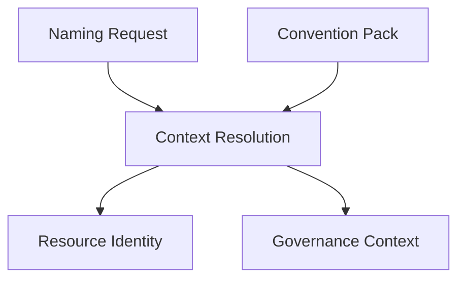

# Context Resolution

Context Resolution is the conceptual process that turns a minimal
[Naming Request](./naming-request.md) into the two canonical models every adapter
consumes: [Resource Identity](./resource-identity.md) and
[Governance Context](./governance-context.md). It is the mechanism, not a model itself —
it does not introduce new attributes; it explains how the attributes defined elsewhere
are combined and completed.

Context Resolution only produces canonical models. It does not generate names, tags,
labels, annotations, or other platform-specific outputs — those belong to Convention
Evaluation (see [`convention-result.md`](./convention-result.md)).

## Purpose

A caller supplies only the information that is specific to a single resource. Context
Resolution supplies everything else: organizational placement, deployment context, and
governance defaults that would otherwise have to be repeated on every request. Its
purpose is to produce a complete, deterministic Resource Identity and Governance Context
from a small, focused request.

## Resolution sources

Context Resolution combines information from several sources:

- **Naming Request** — the caller-supplied values specific to the resource being named
  (see [`naming-request.md`](./naming-request.md)).
- **Convention Pack** — selected explicitly via the request's `convention` field;
  supplies naming defaults, deployment defaults, governance defaults (including an
  optional default Governance Profile), and metadata projection rules (see
  [`convention-pack.md`](./convention-pack.md)).
- **Shared organizational context** — organizational values that are stable across many
  requests (for example, `organization`, `business_unit`) and do not need to be repeated
  by the caller.
- **Shared deployment context** — deployment values that are resolved from the
  environment in which the request is made (for example, `platform`, `deployment_scope`).
- **Governance Profile defaults** — governance defaults declared by the selected
  Governance Profile (see [`governance-context.md`](./governance-context.md)).

## Resolution precedence

Context Resolution applies these sources in a fixed order, from lowest to highest
precedence:

1. **Convention Pack defaults** — naming, deployment, and metadata defaults declared by
   the selected Convention Pack. These are the broadest defaults and apply first.
2. **Shared Organizational Context** — organizational values resolved from shared
   context. These override Convention Pack defaults because they reflect the actual
   organizational placement of the resource.
3. **Shared Deployment Context** — deployment values resolved from shared context. These
   override both prior layers because they reflect where the resource is actually being
   deployed.
4. **Governance Profile defaults** — governance defaults declared by the selected
   Governance Profile. These apply after identity-related context because governance is
   resolved independently of deployment and organizational placement.
5. **Naming Request values** — values explicitly supplied by the caller in the Naming
   Request. A caller-supplied value always takes precedence over any default.
6. **Validated explicit overrides** — values supplied in the request's `overrides`
   block. These are the most specific, deliberate values a caller can provide and
   always win, but they are still validated during Convention Evaluation (see
   [Overrides](#overrides) below).

This is the same precedence order described in
[`naming-request.md`](./naming-request.md); it is defined once here and referenced from
there to avoid two independent, potentially diverging descriptions.

## Derived attributes

Some attributes are never supplied directly by the caller because they are derived
during Context Resolution. For example, `platform` is normally derived from the
resource type, its Resource Definition, or the adapter in use, rather than repeated on
every request (see [`resource-identity.md`](./resource-identity.md)). Derived attributes
still participate in the same precedence order as any other resolved value.

## Overrides

The `overrides` block on a Naming Request exists specifically to let a caller bypass
resolved or defaulted values when a resource is a deliberate, documented exception.
Because overrides have the highest precedence, they should be used sparingly and only
when a value genuinely cannot be produced correctly by resolution.

Overrides are still validated during Convention Evaluation. They only bypass Context
Resolution defaults — the Convention Pack defaults, shared organizational and deployment
context, and Governance Profile defaults described above. They do not bypass:

- Resource Definition constraints (see [`resource-definition.md`](./resource-definition.md));
- Convention Pack restrictions on which attributes may be overridden;
- schema validation of the Naming Request itself.

In other words, an override changes *where* a value comes from, not *whether* it must
still be a valid value for the resource being named.

## Deterministic behaviour

Context Resolution must be deterministic: given the same Naming Request, the same
Convention Pack, and the same shared context, it must always produce the same Resource
Identity and Governance Context. This is what allows every adapter to render equivalent
output from equivalent input, and it is a precondition for meaningful contract and
compatibility testing across the Specification.

## What Context Resolution produces

Context Resolution produces exactly two canonical models:

- [Resource Identity](./resource-identity.md) — the complete, three-plane description of
  what the resource is.
- [Governance Context](./governance-context.md) — the complete description of who owns,
  pays for, and manages the resource.

Context Resolution does not produce a Convention Result directly, and it does not
resolve the resource's [Resource Definition](./resource-definition.md). Once Resource
Identity has been completed, its `functional.resource_type` value is used to look up
the corresponding Resource Definition — a lookup, not a step Context Resolution
performs. Resource Identity, Governance Context, and the selected Resource Definition
are then handed to Convention Evaluation, which produces a
[Convention Result](./convention-result.md).

## Where Context Resolution fits

This is a focused view of the pipeline described in
[`specification/README.md`](./README.md#architecture); it omits Resource Definition and
Convention Evaluation because they are outside the scope of Context Resolution itself.
Notice that the Naming Request and Convention Pack are both inputs to Context
Resolution — Context Resolution is the processing stage, not the Convention Pack.
