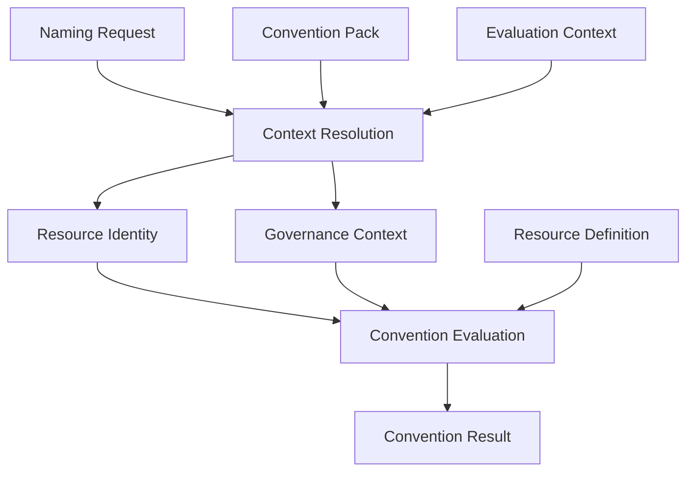

# Convention Pack

A Convention Pack is the Specification artifact that answers:

**Purpose:** "How should this organization project canonical models into
platform-specific conventions?"

Convention Packs define organizational policy. They do not define technical platform
constraints, and they do not implement naming. A Convention Pack describes *how*
[Resource Identity](./resource-identity.md) and
[Governance Context](./governance-context.md) should be projected into names, tags,
labels, and annotations — not what those models are, and not the technical rules a
platform imposes on a resource type.

A Convention Pack is selected explicitly by a [Naming Request](./naming-request.md),
using its `convention` field:

```yaml
convention: aws-workload-default
```

The identifier selects the Convention Pack; it does not embed the pack's contents in
the request. The selected Convention Pack is then consumed by
[Context Resolution](./context-resolution.md) and by
[Convention Evaluation](./convention-result.md#convention-evaluation-pipeline).

## Composed from reusable convention dimensions

A Convention Pack remains the single Specification Artifact selected by a Naming
Request's `convention` field — callers select one effective Convention Pack, never three
independent policies. Internally, however, an effective Convention Pack may be
assembled from reusable convention dimensions, so that stable convention is written once and
reused across many effective packs instead of being redefined for every organization,
product, or platform combination:

```text
Convention Pack
├── Platform Convention
├── Organization Convention
└── Deployment Convention
```

- **[Platform Convention](./policies/platform-convention.md)** — how conventions are projected
  for a target infrastructure platform (for example, AWS, Azure, or Kubernetes).
- **[Organization Convention](./policies/organization-convention.md)** — how an organization
  structures and governs its infrastructure platforms (for example, an AWS Organization
  managed through Control Tower, or an Azure Landing Zone).
- **[Deployment Convention](./policies/deployment-convention.md)** — the workload purpose,
  tenancy, isolation, and optional service-tier mapping used by a product or platform
  (for example, an internal workload or a SaaS product).

A concrete Convention Pack may reference, extend, or compose these reusable policy
artifacts, but resolving that composition into a single effective Convention Pack is a
Specification Artifact concern — it happens when the effective Convention Pack is
authored, not as an additional runtime processing stage. The Specification continues to
have exactly two processing stages, Context Resolution and Convention Evaluation (see
[`context-resolution.md`](./context-resolution.md) and
[`convention-result.md`](./convention-result.md#convention-evaluation-pipeline));
composing Platform Convention, Organization Convention, and Deployment Convention into an
effective Convention Pack is not a third stage.

Because these dimensions are independent, the same Deployment Convention can be
composed with different Platform Convention and Organization Convention dimensions to
target different platforms — see
[Deployment Convention: Cross-platform reuse](./policies/deployment-convention.md#cross-platform-reuse).

This document does not define a composition or merge algorithm for these dimensions,
consistent with [Out of scope](#out-of-scope) below.

## Responsibilities

A Convention Pack may define the following, each described briefly below.

**Identity defaults** — default values for Resource Identity attributes that are not
supplied on the Naming Request and cannot be resolved from shared context, allowing a
caller to omit organizationally stable values on every request.

**Governance defaults** — default values for Governance Context attributes, including a
default Governance Profile to apply when the caller does not select one explicitly (see
[`governance-context.md`](./governance-context.md)).

**Required attributes** — which Resource Identity and Governance Context attributes must
be available before Convention Evaluation can proceed, so that incomplete requests are
rejected consistently rather than producing partial or ambiguous output.

**Naming component ordering** — the order in which resolved identity components appear
in a generated name, so that names are structured predictably across every resource
produced under the pack.

**Abbreviations** — the shortened forms used to represent identity components in
generated names, keeping names within practical length limits while remaining
recognizable.

**Normalization rules** — how resolved values should be conformed to the pack's naming
style (for example, preferred casing or word separation) before being combined into a
generated name, independently of any technical constraint imposed by a platform.

**Metadata projection rules** — how resolved Resource Identity and Governance Context
attributes map onto platform-specific tags, labels, and annotations.

**Override policy** — which attributes may or may not be overridden on a Naming Request,
and what validation applies to an override when it is allowed (see
[Override policy](#override-policy) below).

## What a Convention Pack must NOT define

A Convention Pack must not define:

- provider technical constraints;
- maximum name lengths;
- allowed provider characters;
- uniqueness algorithms;
- provider API behaviour;
- implementation details;
- adapter logic.

These responsibilities belong to [Resource Definition](./resource-definition.md), which
describes the technical rules a resource type must respect, or to adapters, which
translate a Convention Result into a tool-specific interface. A Convention Pack decides
*how organizational policy is projected*; a Resource Definition decides *what a platform
technically allows*. Confusing the two would let organizational policy silently depend
on provider-specific technical limits, and would prevent the same Convention Pack from
being reused unchanged across platforms.

This restriction applies equally to every reusable convention dimension a Convention Pack
may compose — [Platform Convention](./policies/platform-convention.md),
[Organization Convention](./policies/organization-convention.md), and
[Deployment Convention](./policies/deployment-convention.md) alike (see
[Composed from reusable convention dimensions](#composed-from-reusable-convention-dimensions)
above).

## Relationship with the other concepts

**Naming Request** — a Naming Request selects a Convention Pack explicitly via its
`convention` field. The Naming Request does not contain the pack's contents; it only
references the pack by identifier (see [`naming-request.md`](./naming-request.md)).

**Resource Identity** — a Convention Pack supplies identity defaults and required
attributes, and defines how a resolved Resource Identity is projected into a generated
name. It does not alter what Resource Identity fundamentally is (see
[`resource-identity.md`](./resource-identity.md)).

**Governance Context** — a Convention Pack supplies governance defaults, including an
optional default Governance Profile, and defines how a resolved Governance Context is
projected into tags, labels, and annotations. It does not replace Governance Context
(see [`governance-context.md`](./governance-context.md)).

**Context Resolution** — a Convention Pack is one of the inputs Context Resolution
combines, alongside the Naming Request and shared context, to produce a complete
Resource Identity and Governance Context (see
[`context-resolution.md`](./context-resolution.md)).

**Resource Definition** — a Convention Pack and a Resource Definition are consulted
together during Convention Evaluation, but they answer different questions: a Convention
Pack defines organizational projection policy, while a Resource Definition defines
technical constraints for a resource type (see
[`resource-definition.md`](./resource-definition.md)).

**Convention Result** — a Convention Pack's naming, metadata projection, and override
policy determine much of the generated name, tags, labels, and annotations that appear
in the final Convention Result (see [`convention-result.md`](./convention-result.md)).

## Convention Pack lifecycle

The conceptual lifecycle of a Convention Pack, from selection to output, is:

```text
Naming Request + Convention Pack
    -> Context Resolution
        -> Resource Identity + Governance Context
            -> Convention Evaluation (with Resource Definition)
                -> Convention Result
```

A Convention Pack is selected by the Naming Request's `convention` field, but it is an
input to Context Resolution alongside the Naming Request, not a step between them:
Context Resolution is the only processing stage that consumes both. This describes the
conceptual order in which a Convention Pack participates in producing a Convention
Result. It does not describe an implementation, execution runtime, or API.

Convention Pack composition is the primary reuse mechanism in this iteration. This
document does not define a Convention Pack inheritance model; if inheritance is
reintroduced later, it must remain separate from the reusable convention dimensions and
their composition rules.

## Convention Pack naming

Effective Convention Pack identifiers should be clear about which convention dimensions
they compose. Examples of effective, composed Convention Pack identifiers:

```text
corporate-aws-internal
product-a-aws-saas-shared
product-b-aws-saas-trial
product-b-aws-saas-standard
product-b-aws-saas-enterprise
product-b-azure-saas-enterprise
product-b-kubernetes-saas-enterprise
```

These identifiers represent effective, composed conventions — for example,
`product-b-aws-saas-enterprise` composes an AWS Platform Convention, `product-b`'s AWS
Organization Convention, and a Deployment Convention that maps the Enterprise service
tier to dedicated isolation.
They do not encode individual tenant names or dynamically generated deployment scopes:
every Enterprise tenant of `product-b` on AWS is named through the same
`product-b-aws-saas-enterprise` Convention Pack, with the tenant's dedicated deployment
scope supplied as Provisioning Context rather than encoded in the pack's identifier (see
[`context-resolution.md`](./context-resolution.md#evaluation-context)).
See [`policies/deployment-convention.md`](./policies/deployment-convention.md#illustrative-scenarios)
for the scenarios these examples illustrate.

This document does not standardize the exact naming syntax for effective Convention
Pack identifiers; the examples above illustrate the composition, not a required naming
grammar.

## Required attributes

A Convention Pack may declare which Resource Identity and Governance Context attributes
must be available before Convention Evaluation proceeds. Examples include
`organizational.system`, `deployment.environment`, and `functional.resource_type`. This
is the conceptual place where mandatory fields are defined for a given organizational
context — it is not encoded in the Naming Request, Resource Identity, or Governance
Context JSON Schemas, since the same canonical models may have different required
attributes under different Convention Packs.

## Naming projections

A Convention Pack defines how a resolved canonical identity is projected into a
generated name. This conceptually includes decisions such as which components are
included and in what order, what separators are used between them, which abbreviations
apply, which components may be omitted for a given resource, and what casing style is
used. This document does not define any concrete naming syntax; it only describes that
this is a Convention Pack responsibility.

## Metadata projections

A Convention Pack defines how resolved Resource Identity and Governance Context become
platform-specific metadata, such as AWS Tags, Azure Tags, Kubernetes Labels, and
Kubernetes Annotations. This document does not define concrete key mappings or value
formats; it only describes that this is a Convention Pack responsibility, consistent
with the metadata projection described in
[`governance-context.md`](./governance-context.md#metadata-projection).

## Override policy

A Convention Pack may define which attributes are overridable, which are protected from
being overridden, and what validation policy applies to an allowed override. The
responsibilities are divided as follows:

- **Context Resolution** accepts overrides supplied in a Naming Request's `overrides`
  block (see [`context-resolution.md`](./context-resolution.md#overrides)).
- **Convention Packs** decide whether a given attribute is allowed to be overridden at
  all.
- **Convention Evaluation** validates an allowed override against Resource Definition
  constraints and Specification rules before it is used.

## Versioning

Convention Packs are versioned independently of the Specification itself. Changing a
Convention Pack's required attributes, abbreviations, component ordering, or metadata
projections may change the generated name, tags, labels, or annotations for resources
that already exist, which is a potentially breaking change. Convention Packs therefore
follow [Semantic Versioning](https://semver.org/), consistent with how the rest of the
Specification treats naming algorithms, abbreviations, and generated outputs (see
[`AGENTS.md`](../AGENTS.md#compatibility-and-versioning)).

## Out of scope

This document defines the *concept* of a Convention Pack only. It intentionally does
not define:

- actual Convention Packs (for example, `aws-workload-default`);
- concrete Platform Convention, Organization Convention, or Deployment Convention artifacts
  (see [`policies/`](./policies/));
- YAML or JSON syntax for expressing a Convention Pack or any of its composed policy
  dimensions;
- a JSON Schema for Convention Packs or any of its composed policy dimensions;
- an inheritance algorithm;
- a composition or merge algorithm for Platform Convention, Organization Convention, and
  Deployment Convention;
- any implementation.

These are left for a later iteration of the Specification, once the conceptual model has
been validated.

## Where Convention Pack fits



This is the same canonical pipeline described in
[`specification/README.md`](./README.md#architecture). Notice that Convention Pack is an
input to Context Resolution, alongside the Naming Request and Evaluation Context — it is
not itself a processing stage. The pipeline has exactly two processing stages, Context
Resolution and Convention Evaluation; every other concept, including Convention Pack, is
a domain model or Specification artifact consumed by one of those two stages.
