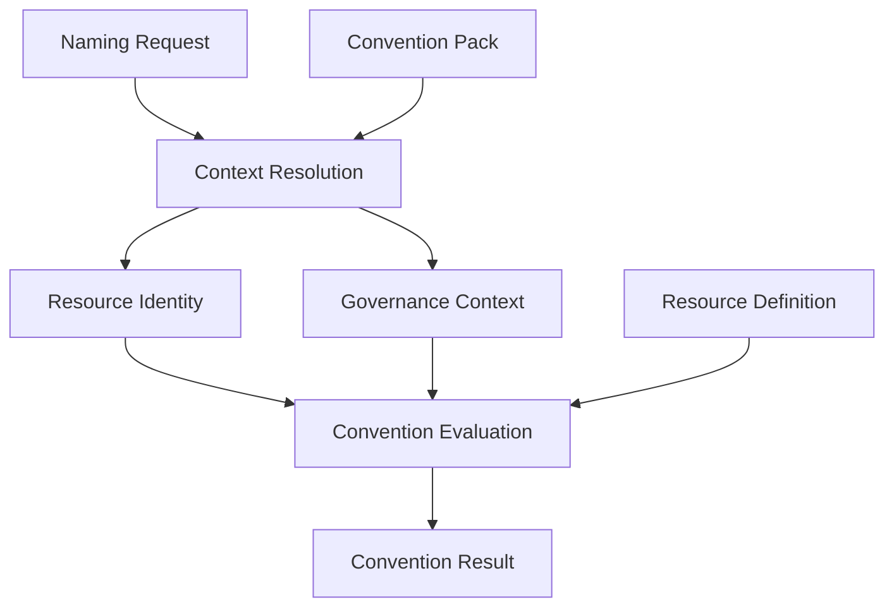

# Convention Result

Convention Result is the conceptual output produced by Convention Evaluation once it has
evaluated the Specification against a resource's resolved
[Resource Identity](./resource-identity.md), [Governance Context](./governance-context.md),
and [Resource Definition](./resource-definition.md). It is the final artifact returned to
the caller of a [Naming Request](./naming-request.md).

## Convention Result is more than a generated name

A Convention Result is not merely a string. It is a structured, conceptual bundle that
captures both the resolved context and every convention output produced from it, along
with information about how and whether that output is valid. Consumers should be able to
inspect a Convention Result to understand not just the generated name, but the identity
and governance context it was derived from, and whether it is safe to use.

## Conceptual contents

Convention Result conceptually consists of:

- **Resource Identity** — the resolved, canonical identity the result was generated
  from (see [`resource-identity.md`](./resource-identity.md)).
- **Governance Context** — the resolved ownership and governance context the result was
  generated from (see [`governance-context.md`](./governance-context.md)).
- **Generated name** — the canonical name produced for the resource, following the
  naming conventions defined by the Specification and the selected Convention Pack.
- **Tags** — platform-specific tags (for example, AWS or Azure tags) projected from
  Resource Identity and Governance Context.
- **Labels** — platform-specific labels (for example, Kubernetes labels) projected from
  the same models.
- **Annotations** — platform-specific annotations (for example, Kubernetes annotations)
  projected from the same models.
- **Validation** — the outcome of validating the generated outputs against the
  constraints declared by the resource's Resource Definition and the Specification.
- **Explanation** — a human-readable account of how the result was derived, useful for
  troubleshooting and auditing convention decisions.
- **Warnings** — non-fatal issues detected while generating the result (for example, a
  value that had to be truncated or normalized).

This list describes the conceptual shape of a Convention Result. It intentionally does
not define a JSON Schema; that is left for a later iteration of the Specification.

## Convention Evaluation pipeline

Convention Evaluation conceptually performs the following steps to produce a Convention
Result from a Naming Request:

1. **Resolve Context** — run Context Resolution to combine the Naming Request, the
   selected Convention Pack, and shared context (see
   [`context-resolution.md`](./context-resolution.md)).
2. **Build Resource Identity** — complete the canonical Resource Identity from the
   resolved context.
3. **Build Governance Context** — complete the canonical Governance Context from the
   resolved context.
4. **Resolve Resource Definition** — select the Resource Definition referenced by the
   resolved `resource_type` (see [`resource-definition.md`](./resource-definition.md)).
5. **Evaluate Convention** — apply the Specification's naming, tagging, labeling, and
   annotation conventions, as configured by the selected Convention Pack, to the
   resolved models.
6. **Generate outputs** — produce the generated name, tags, labels, and annotations.
7. **Validate outputs** — check the generated outputs against the constraints declared
   by the Resource Definition and the Specification, collecting any warnings.
8. **Produce Convention Result** — assemble Resource Identity, Governance Context, the
   generated outputs, validation results, explanation, and warnings into the final
   Convention Result.

This is a conceptual, logical pipeline. It intentionally does not describe
implementation details such as data structures, APIs, or execution order guarantees
beyond what is described above.

## Where Convention Result fits

This is the complete architecture described in
[`specification/README.md`](./README.md#architecture): a Convention Result is the final
stage of the pipeline, produced once Resource Identity, Governance Context, and Resource
Definition have all been resolved.
