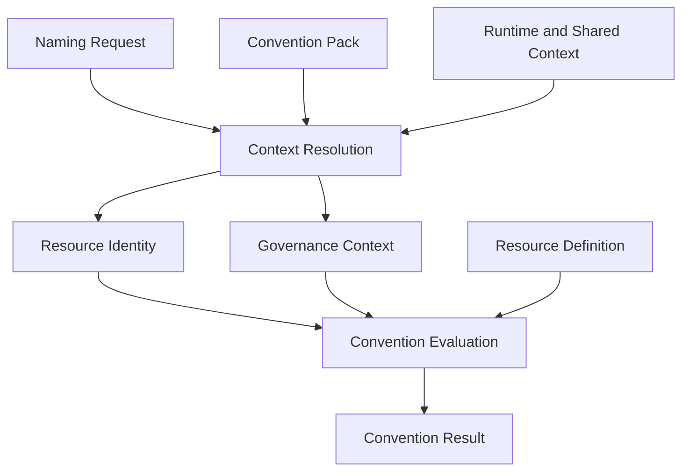

# Governance Context

Governance Context is the canonical domain model used to describe *how a resource is
owned and governed*, independently of what the resource is. It captures operational and
organizational information without changing the canonical identity of the resource
described by [Resource Identity](./resource-identity.md).

Governance answers a distinct question from Resource Identity:

**Purpose:** "Who owns, pays for and manages this resource?"

Governance Context is intentionally independent from Resource Identity. A resource's
identity does not change when its owner, cost center, or governance profile changes, and
governance information does not change when the resource is renamed, moved, or
redeployed.

## Governance attributes

Possible attributes:

- `owner`: Team or person responsible for the resource.
- `managed_by`: Tool or platform managing the resource.
- `cost_center`: Organizational cost allocation identifier.
- `profile`: Identifies the Governance Profile — the governance policy applied to the
  resource. It does not select the Convention Pack, which is chosen independently via
  the Naming Request's `convention` field (see [`naming-request.md`](./naming-request.md)).

## Relationship with Resource Identity

Resource Identity identifies the resource; Governance Context governs it. The two models
answer different questions and evolve independently:

- Resource Identity answers "What is this resource?"
- Governance Context answers "Who owns, pays for and manages this resource?"

Changing Governance Context should not change Resource Identity, and changing Resource
Identity should not require changing Governance Context. Together they form the complete
conceptual input to Convention Evaluation, but only Resource Identity is canonical to a
resource's identity.

## Relationship with Convention Packs

A Convention Pack is a Specification artifact that defines how canonical models are
projected into platform-specific conventions: naming defaults, deployment defaults,
governance defaults, abbreviations, ordering rules, metadata projection, and override
policy (see [`convention-pack.md`](./convention-pack.md)). A Convention Pack may also
declare a default Governance Profile to apply when
the caller does not select one explicitly. However, Convention Pack and Governance
Profile remain different concepts: a Convention Pack is selected via the Naming
Request's `convention` field, while a Governance Profile is selected via
`governance.profile`. Selecting a Convention Pack does not select a Governance Profile,
and a Convention Pack does not replace Governance Context — it only supplies defaults
that Governance Context may use.

## Metadata projection

Governance Context is commonly projected into platform-specific metadata, such as:

- AWS Tags
- Azure Tags
- Kubernetes Labels
- Kubernetes Annotations

This document does not define the implementation details of these projections; that
concern belongs to adapters.

## Future evolution

Governance Profiles may eventually expand to cover additional operational concerns, such
as:

- Classification
- Retention
- Backup policy
- Monitoring
- Compliance
- Operational policy

These concerns are not yet defined in the Specification.

## The Context Resolution pipeline

Governance Context participates in the same Context Resolution pipeline used to resolve
a [Naming Request](./naming-request.md) into a Resource Identity:

This is the same canonical pipeline described in
[`specification/README.md`](./README.md#architecture); see
[`context-resolution.md`](./context-resolution.md) for the full description of how this
resolution happens.

Both Resource Identity and Governance Context participate in convention evaluation:
Convention Evaluation evaluates the Specification against both models, along with the
resource's [Resource Definition](./resource-definition.md), to produce a Convention
Result.
