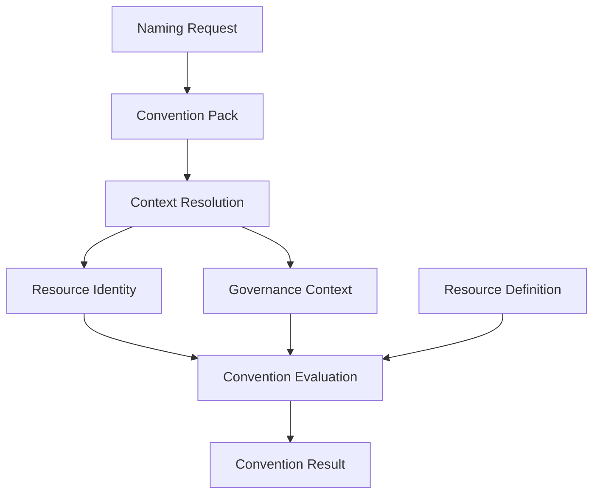

# Naming Request

The Naming Request is the public contract a user or system submits when it needs a
resource named, tagged, or labeled according to project conventions. It is intentionally
small: users describe only the information that is specific to the resource they are
requesting, not the resource's complete Resource Identity.

## Users should not provide a complete Resource Identity

A complete [Resource Identity](./resource-identity.md) spans three planes: organizational,
deployment, and functional. [Governance Context](./governance-context.md) is modeled
separately. Requiring a caller to supply all of that information for every request would
be repetitive, error-prone, and would leak organizational, deployment, and governance
details into every call site.

Instead, a Naming Request carries only the details that are unique to the specific
resource being named — primarily its functional identity and any deployment detail that
cannot be inferred from context. Governance context is optional. Everything else is
resolved on the caller's behalf.

## Request model

Callers should provide only the minimum functional information not already available
from context or the selected Convention Pack. `component` is optional and should not be
required for every request. Governance Context may also be supplied when the caller
knows it:

```yaml
convention: aws-workload-default

resource_type: aws_s3_bucket

functional:
  service: ingestion
  component: storage

deployment:
  instance: "01"

governance:
  owner: platform-team
  managed_by: terraform
  profile: standard

overrides:

  deployment:
    location: us-east-1
```

`resource_type` is exposed at the top level of the Naming Request for convenience and is
resolved into `functional.resource_type` in the canonical Resource Identity. It is not
duplicated inside the `functional` block of the request.

`convention` and `governance.profile` are independent selectors, even though both are
optional values supplied on the same request:

- `convention` selects the Convention Pack — the organizational naming, deployment, and
  metadata projection conventions used to resolve this request.
- `governance.profile` selects the Governance Profile — the governance policy applied to
  the resource (see [`governance-context.md`](./governance-context.md)).

Selecting a Convention Pack does not select a Governance Profile, and selecting a
Governance Profile does not select a Convention Pack. A Convention Pack may declare a
default Governance Profile to apply when the caller does not supply one, but the two
selectors remain independent and may be combined freely.

### Explicit Overrides

The `overrides` block lets a caller intentionally bypass values that Context Resolution
would otherwise resolve or default. Overrides are modeled using the same structure as
the canonical Resource Identity — `organizational`, `deployment`, and `functional` — plus
`governance`, rather than a flat set of arbitrary keys. This makes clear that an override
targets a specific canonical identity or governance attribute, not an unrelated,
free-form value.

Overrides intentionally bypass values resolved during Context Resolution, so they should
only be used for exceptional situations, such as:

- legacy resources that predate current conventions;
- migrations, where a resource must temporarily keep a prior value;
- platform-specific exceptions that cannot be expressed any other way.

Overrides remain part of the canonical model: an overridden attribute still populates
the same Resource Identity or Governance Context attribute it targets, it simply skips
the defaults and shared context that would otherwise have produced it. Overrides are
evaluated after the Naming Request values, which is why they hold the highest
precedence (see [Precedence order](#precedence-order) below).

Future Convention Packs and Resource Definitions may restrict which attributes are
allowed to be overridden. For example, a deployment may forbid overriding
`organization`, a Convention Pack may forbid overriding `deployment_scope`, or a
Resource Definition may reject an overridden value that violates a platform constraint.
This Specification only describes that responsibility; it does not yet define those
restriction rules.

## The Context Resolution pipeline

A Naming Request is transformed through the Context Resolution pipeline into a complete
Resource Identity and Governance Context, and ultimately into a Convention Result:



This is the same canonical pipeline described in
[`specification/README.md`](./README.md#architecture).

- **Naming Request** — the minimal, user-supplied description of the resource.
- **Convention Pack** — a Specification artifact, selected explicitly via the request's
  `convention` field, that defines how canonical models are projected into
  platform-specific conventions: naming defaults, deployment defaults, governance
  defaults (including an optional default Governance Profile), abbreviations, ordering
  rules, metadata projection rules, and override policy. A Convention Pack does not
  replace Governance Context.
- **Context Resolution** — derives deployment context and any other shared values needed
  to complete the model. See [`context-resolution.md`](./context-resolution.md) for the
  full description, including resolution sources and precedence.
- **Resource Identity** — the canonical, fully-resolved identity produced by combining
  the request, the Convention Pack, and shared context.
- **Governance Context** — the resolved ownership and operational governance context for
  the resource. See [`governance-context.md`](./governance-context.md) for the full
  model.
- **Resource Definition** — the technical characteristics and constraints of the
  resource's canonical resource type, selected via `resource_type`. See
  [`resource-definition.md`](./resource-definition.md) for the full model.
- **Convention Evaluation** — evaluates the Specification against Resource Identity,
  Governance Context, and the resource's Resource Definition.
- **Convention Result** — the final output produced for the caller. See
  [`convention-result.md`](./convention-result.md) for its conceptual contents.

In short: Convention Packs project both Resource Identity and Governance Context into
names, AWS Tags, Azure Tags, Kubernetes Labels, annotations, and other convention
outputs. Context Resolution supplies the shared data needed to complete the model;
Convention Evaluation evaluates Resource Identity, Governance Context, and the
resource's Resource Definition to produce a Convention Result.

## Precedence order

When Context Resolution completes the model, values are applied in the following order,
from lowest to highest precedence:

1. **Convention Pack defaults** — naming, deployment, and metadata defaults declared by
   the selected Convention Pack.
2. **Shared Organizational Context** — organizational values resolved from shared
   context (for example, `organization`, `business_unit`).
3. **Shared Deployment Context** — deployment values resolved from shared context (for
   example, `platform`, `deployment_scope`).
4. **Governance Profile defaults** — governance defaults declared by the selected
   Governance Profile.
5. **Naming Request values** — values explicitly supplied by the caller in the Naming
   Request.
6. **Validated explicit overrides** — values supplied in the request's `overrides`
   block. See [Explicit Overrides](#explicit-overrides) above for the structure and
   intended use of this block.

Convention Packs establish organizational naming and metadata conventions; Governance
Profiles establish governance defaults. Values explicitly supplied in the Naming Request
override any default from either source, and explicit overrides always take the highest
precedence.

This is the same precedence order defined in
[`context-resolution.md`](./context-resolution.md#resolution-precedence), which is the
canonical source for this description.

## Differences between the core concepts

| Concept              | Description                                                                                       | Supplied by                          |
| -------------------- | --------------------------------------------------------------------------------------------------|---------------------------------------|
| **Naming Request**    | The minimal, public request describing what is specific to a single resource.                     | The caller (user or system).          |
| **Resource Identity** | The complete, canonical, three-plane model describing a resource's identity.                      | Resolved by Context Resolution.       |
| **Governance Context** | The operational ownership and policy context associated with the resource.                         | Resolved from the request and shared context. |
| **Convention Pack**   | A Specification artifact, selected via `convention`, that defines how canonical models are projected into platform-specific conventions: naming defaults, deployment defaults, governance defaults (including an optional default Governance Profile), abbreviations, ordering rules, metadata projection, and override policy. It does not replace Governance Context. | Provided by the project or organization; selected by the caller. |
| **Governance Profile** | The named governance policy, selected via `governance.profile`, that supplies governance defaults independently of the Convention Pack. | Provided by the project or organization; selected by the caller. |
| **Resource Definition** | The technical characteristics and constraints of the resource's canonical resource type, selected via `resource_type`. | Provided by the project or platform; referenced via the resource's `resource_type`. |
| **Convention Result** | The final output produced by evaluating the Specification against Resource Identity, Governance Context, and Resource Definition. | Produced by Convention Evaluation.    |

A Naming Request is an *input*; Resource Identity is the *canonical internal model*;
Governance Context is the separate operational policy model; a Convention Pack is
*configuration* that shapes how the request is enriched; a Resource Definition is the
*technical specification* referenced by `resource_type`; and a Convention Result is the
*output* consumed by the caller.
