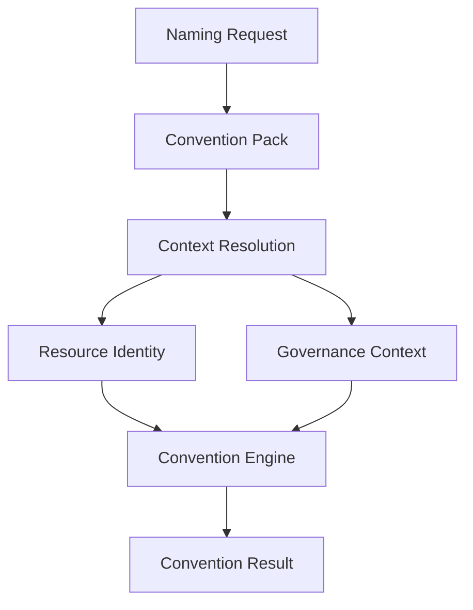

# Naming Request

The Naming Request is the public contract a user or system submits when it needs a
resource named, tagged, or labeled according to project conventions. It is intentionally
small: users describe only the information that is specific to the resource they are
requesting, not the resource's complete Resource Identity.

## Users should not provide a complete Resource Identity

A complete [Resource Identity](./resource-identity.md) spans three planes: organizational,
deployment, and functional. [Governance Context](./resource-identity.md) is modeled
separately. Requiring a caller to supply all of that information for every request would
be repetitive, error-prone, and would leak organizational, deployment, and governance
details into every call site.

Instead, a Naming Request carries only the details that are unique to the specific
resource being named — primarily its functional identity and any deployment detail that
cannot be inferred from context. Governance context is optional. Everything else is
resolved on the caller's behalf.

## Request model

Callers should provide only the minimum functional information not already available
from context or the selected Convention Pack. `component` is optional and should not be
required for every request. Governance Context may also be supplied when the caller
knows it:

```yaml
resource_type: aws_s3_bucket

functional:
  service: ingestion

governance:
  owner: platform-team
  managed_by: terraform
```

`resource_type` is exposed at the top level of the Naming Request for convenience and is
resolved into `functional.resource_type` in the canonical Resource Identity. It is not
duplicated inside the `functional` block of the request.

## The Context Resolution pipeline

A Naming Request is transformed through the Context Resolution pipeline into a complete
Resource Identity and Governance Context, and ultimately into a Convention Result:



- **Naming Request** — the minimal, user-supplied description of the resource.
- **Convention Pack** — enriches the request with identity defaults, governance defaults,
  naming rules, and metadata projections appropriate to the organization or platform in
  use.
- **Context Resolution** — derives deployment context and any other shared values needed
  to complete the model.
- **Resource Identity** — the canonical, fully-resolved identity produced by combining
  the request, the Convention Pack, and shared context.
- **Governance Context** — the resolved ownership and operational governance context for
  the resource.
- **Convention Engine** — evaluates the Specification against Resource Identity and
  Governance Context.
- **Convention Result** — the final output produced for the caller.

In short: Convention Packs project both Resource Identity and Governance Context into
names, AWS Tags, Azure Tags, Kubernetes Labels, annotations, and other convention
outputs. Context Resolution supplies the shared data needed to complete the model; the
Convention Engine evaluates both models to produce a Convention Result.

## Differences between the core concepts

| Concept              | Description                                                                                       | Supplied by                          |
| -------------------- | --------------------------------------------------------------------------------------------------|---------------------------------------|
| **Naming Request**    | The minimal, public request describing what is specific to a single resource.                     | The caller (user or system).          |
| **Resource Identity** | The complete, canonical, three-plane model describing a resource's identity.                      | Resolved by the Convention Engine.    |
| **Governance Context** | The operational ownership and policy context associated with the resource.                         | Resolved from the request and shared context. |
| **Convention Pack**   | A reusable configuration that enriches a Naming Request with identity defaults, governance defaults, naming rules, and metadata projections. | Provided by the project or organization. |
| **Convention Result** | The final output produced by evaluating the Specification against Resource Identity and Governance Context. | Produced by the Convention Engine.    |

A Naming Request is an *input*; Resource Identity is the *canonical internal model*;
Governance Context is the separate operational policy model; a Convention Pack is
*configuration* that shapes how the request is enriched; and a Convention Result is the
*output* consumed by the caller.
