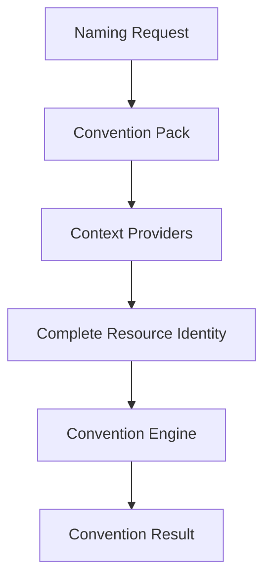

# Naming Request

The Naming Request is the public contract a user or system submits when it needs a
resource named, tagged, or labeled according to project conventions. It is intentionally
small: users describe only the information that is specific to the resource they are
requesting, not the resource's complete Resource Identity.

## Users should not provide a complete Resource Identity

A complete [Resource Identity](./resource-identity.md) spans four planes and can include
organizational, deployment, functional, and operational attributes. Requiring a caller to
supply all of that information for every request would be repetitive, error-prone, and
would leak organizational and deployment details into every call site.

Instead, a Naming Request carries only the details that are unique to the specific
resource being named — primarily its functional identity and any deployment detail that
cannot be inferred from context. Everything else is resolved on the caller's behalf.

## The Context Resolution pipeline

A Naming Request is transformed into a complete Resource Identity, and ultimately into a
Convention Result, through the Context Resolution pipeline:

- **Naming Request** — the minimal, user-supplied description of the resource.
- **Convention Pack** — enriches the request with organizational defaults and governance
  rules appropriate to the organization or platform in use.
- **Context Providers** — supply deployment information that can be determined from the
  environment the request is made in, rather than requiring the caller to specify it.
  `deployment_scope`, `environment`, and `location` typically come from this shared
  deployment context, while `platform` is normally derived from the resource type or
  resource definition itself. The Naming Request does not require callers to repeat
  these derived values.
- **Complete Resource Identity** — the canonical, fully-resolved identity produced by
  combining the request, the Convention Pack, and the Context Providers.
- **Convention Engine** — evaluates the Specification against the Complete Resource
  Identity.
- **Convention Result** — the final output produced for the caller.

In short: Convention Packs enrich the request with organizational and governance
defaults; Context Providers supply deployment information; and the Convention Engine
combines both with the original request to build the canonical Resource Identity, which
it then evaluates to produce a Convention Result.

## Differences between the core concepts

| Concept              | Description                                                                                       | Supplied by                          |
| -------------------- | --------------------------------------------------------------------------------------------------|---------------------------------------|
| **Naming Request**    | The minimal, public request describing what is specific to a single resource.                     | The caller (user or system).          |
| **Resource Identity** | The complete, canonical, four-plane model describing a resource's full identity.                  | Resolved by the Convention Engine.    |
| **Convention Pack**   | A reusable configuration that enriches a Naming Request with organizational and governance defaults appropriate to a given organization or platform. | Provided by the project or organization. |
| **Convention Result** | The final output produced by evaluating the Specification against a Resource Identity.            | Produced by the Convention Engine.    |

A Naming Request is an *input*; a Resource Identity is the *canonical internal model*; a
Convention Pack is *configuration* that shapes how a request is enriched; and a
Convention Result is the *output* consumed by the caller.
