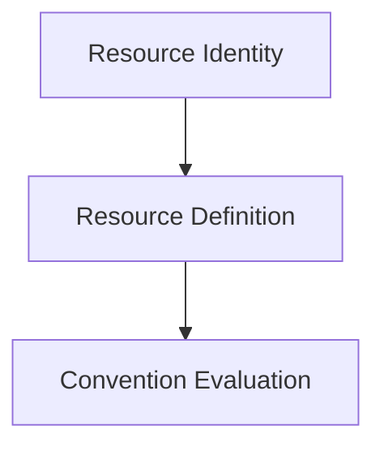

# Resource Definition

A Resource Definition describes the technical characteristics of a canonical resource
type, independently of any specific resource instance. Where
[Resource Identity](./resource-identity.md) describes *what a particular resource is*,
a Resource Definition describes *what a kind of resource can be* — the technical shape,
constraints, and valid deployment topology that every instance of that resource type
must respect.

## Purpose

**Purpose:** "What are the technical rules for this kind of resource, including where it
may or must exist?"

Resource Identity's Functional Identity plane includes a `resource_type` attribute —
the canonical technical resource kind (see [`resource-identity.md`](./resource-identity.md)).
A Resource Definition is the technical specification referenced by that `resource_type`.
It exists so that Convention Evaluation and adapters can apply resource-type-specific
rules consistently, instead of re-deriving them ad hoc for every resource.

## Responsibilities

A Resource Definition is conceptually responsible for describing a resource type's
canonical identifier, platform, and category, along with the identity constraints,
rendering constraints, and placement constraints that every instance of that resource
type must respect:

- **Canonical identifier** — the stable identifier for the resource type (the value used
  as `resource_type` in a Resource Identity).
- **Platform** — the infrastructure platform the resource type belongs to (for example,
  AWS, Azure, or Kubernetes).
- **Category** — a broader technical grouping the resource type belongs to (for example,
  storage, compute, networking).

### Identity constraints

Identity constraints define the identity characteristics of a resource type — whether
and how instances of it must be distinguished from one another:

- **Uniqueness** — whether names or identifiers for this resource type must be unique
  within an account, a region, a namespace, or globally.
- **Scope** — the administrative or isolation boundary within which uniqueness and other
  identity rules apply.
- **Global visibility** — whether the resource type is global or bound to a specific
  location, affecting whether `location` is meaningful for it.

### Rendering constraints

Rendering constraints define how a valid representation of the resource type must be
generated:

- **Technical constraints** — limits inherent to the resource type itself, such as
  maximum length, allowed characters, casing, and separators imposed by the underlying
  platform.
- **Normalization requirements** — how raw input must be transformed to produce a valid
  value for this resource type (for example, lower-casing, character substitution, or
  truncation rules).
- **Provider-specific capabilities** — technical capabilities or limitations specific to
  the platform or provider that Convention Evaluation must respect when generating
  outputs for this resource type.

### Placement Constraints

Placement Constraints describe the valid deployment topology for a resource type — not
only where a resource of this type may or must exist, but also how it must relate to
other resources it depends on. They belong to the resource type itself, independently of
any organization, platform convention, or deployment convention: the same resource type
carries the same Placement Constraints no matter which Convention Pack names it.

Placement Constraints may express concepts such as:

- global resources, with no meaningful `location`;
- regional resources, bound to a specific `location`;
- account-scoped, subscription-scoped, namespace-scoped, or cluster-scoped resources;
- co-location requirements with another resource (for example, requiring a certificate
  to be deployed in the same region as the service that consumes it);
- provider-specific placement restrictions;
- conditional placement rules, where the required placement depends on how the resource
  is used or which other resource it is associated with;
- required deployment scope characteristics, such as a specific administrative or
  isolation boundary.

Some placement rules are conditional rather than fixed — for example, an AWS ACM
Certificate is normally regional, but must exist in `us-east-1` specifically when it is
associated with a CloudFront Distribution. See
[Illustrative examples](#illustrative-examples) below for further, purely conceptual
examples; this document does not define a provider catalog.

This list describes the conceptual responsibilities of a Resource Definition. It is not
an exhaustive attribute list, and no schema is defined for it yet.

## Relationship with Resource Identity

A Resource Definition is selected through Resource Identity's Functional Identity plane:

```text
Resource Identity
    -> functional.resource_type
        -> Resource Definition
```

`resource_type` is the link between the two models: Resource Identity identifies a
specific resource, and its `resource_type` value selects the Resource Definition that
describes the technical rules that resource must follow. Resource Identity remains
canonical and independent — it does not embed a Resource Definition's technical details
directly; it only references one by `resource_type`.

This selection happens once Resource Identity has been completed. Resource Definition
lookup is independent of [Context Resolution](./context-resolution.md): Context
Resolution produces Resource Identity and Governance Context only, and does not itself
select or resolve a Resource Definition.

`deployment.location` continues to belong to Resource Identity (see
[`resource-identity.md`](./resource-identity.md#plane-2-deployment-identity)): Resource 
Identity defines the resource's canonical deployment location. Placement
Constraints define whether that location is valid for the selected resource type — they
never replace or duplicate it. For example, a Resource Identity with
`deployment.location: us-east-1` satisfies an AWS ACM Certificate's Placement Constraint
that requires `us-east-1` when the certificate is associated with CloudFront, while a
different `deployment.location` value would not. Convention Evaluation validates this
relationship; the Resource Definition itself never changes Resource Identity.

## Relationship with Convention Evaluation

Convention Evaluation consults a resource's Resource Definition, alongside its
[Resource Identity](./resource-identity.md) and [Governance Context](./governance-context.md),
when evaluating conventions and generating outputs. Technical constraints declared by
the Resource Definition (for example, maximum name length or allowed characters)
constrain how Convention Evaluation generates a name, and inform the validation and
warnings included in the resulting [Convention Result](./convention-result.md).

Convention Evaluation validates Placement Constraints exactly as it already validates
technical constraints, normalization, and uniqueness: it checks that the resolved
Resource Identity satisfies the Placement Constraints declared by the selected Resource
Definition, and reports a validation failure or warning in the Convention Result when it
does not. Convention Evaluation does not invent placement; it only validates a
relationship the Resource Definition already declares.

## Relationship with Convention Pack and Platform Convention

A [Convention Pack](./convention-pack.md) — including a
[Platform Convention](./policies/platform-convention.md) it may compose — may reference or
declare compatibility with a Resource Definition, but it does not replace or duplicate
the technical constraints a Resource Definition declares. Maximum name length, allowed
characters, uniqueness scope, normalization requirements, and Placement Constraints
remain Resource Definition responsibilities regardless of which Convention Pack,
Platform Convention, Organization Convention, or Deployment Convention applies to a
resource.

A Convention Pack may provide identity defaults, project metadata, and require
attributes, but it must never decide placement. For example, a Convention Pack must not
encode a rule such as "CloudFront certificates must be in `us-east-1`" — that rule
belongs exclusively to the AWS ACM Certificate's Resource Definition, since it is a
property of the resource type itself, not of any organization's or product's naming
convention.

## Illustrative examples

The following examples are conceptual only and do not define a provider catalog (see
[Out of scope for this document](#out-of-scope-for-this-document) below).

### AWS ACM Certificate

Placement Constraints:

- conditional location;
- must be `us-east-1` when associated with a CloudFront Distribution.

### IAM Role

Placement Constraints:

- global within the deployment scope (AWS account).

### Route53 Hosted Zone

Placement Constraints:

- global.

### S3 Bucket

Placement Constraints:

- regional;
- location chosen by the deployment.

### Azure Front Door

Placement Constraints:

- provider-specific placement constraints.

These examples illustrate the kind of rule a Resource Definition may declare; they are
not an exhaustive or normative catalog.

## Out of scope for this document

This document defines the *concept* of a Resource Definition only. It intentionally does
not:

- Define an actual catalog of resource types.
- Define concrete AWS, Azure, or Kubernetes resource types.
- Define a JSON Schema for Resource Definitions.
- Define a formal schema or grammar for expressing Placement Constraints.

These are left for a later iteration of the Specification, once the conceptual model has
been validated.

## Where Resource Definition fits



This is a focused view of the pipeline described in
[`specification/README.md`](./README.md#architecture); it shows only how Resource
Definition relates to Resource Identity and Convention Evaluation. The arrow from
Resource Identity to Resource Definition represents a lookup by `resource_type`, not a
processing stage — the only processing stages in the Specification are Context
Resolution and Convention Evaluation.
