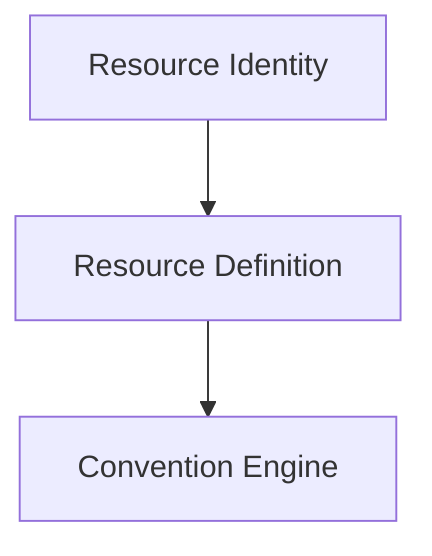

# Resource Definition

A Resource Definition describes the technical characteristics of a canonical resource
type, independently of any specific resource instance. Where
[Resource Identity](./resource-identity.md) describes *what a particular resource is*,
a Resource Definition describes *what a kind of resource can be* — the technical shape
and constraints that every instance of that resource type must respect.

## Purpose

**Purpose:** "What are the technical rules for this kind of resource?"

Resource Identity's Functional Identity plane includes a `resource_type` attribute —
the canonical technical resource kind (see [`resource-identity.md`](./resource-identity.md)).
A Resource Definition is the technical specification referenced by that `resource_type`.
It exists so that the Convention Engine and adapters can apply resource-type-specific
rules consistently, instead of re-deriving them ad hoc for every resource.

## Responsibilities

A Resource Definition is conceptually responsible for describing:

- **Canonical identifier** — the stable identifier for the resource type (the value used
  as `resource_type` in a Resource Identity).
- **Platform** — the infrastructure platform the resource type belongs to (for example,
  AWS, Azure, or Kubernetes).
- **Category** — a broader technical grouping the resource type belongs to (for example,
  storage, compute, networking).
- **Technical constraints** — limits inherent to the resource type itself, such as
  allowed characters, length limits, or casing rules imposed by the underlying platform.
- **Uniqueness requirements** — whether names or identifiers for this resource type must
  be unique within an account, a region, a namespace, or globally.
- **Normalization requirements** — how raw input must be transformed to produce a valid
  value for this resource type (for example, lower-casing, character substitution, or
  truncation rules).
- **Provider-specific capabilities** — technical capabilities or limitations specific to
  the platform or provider that the Convention Engine must respect when generating
  outputs for this resource type.

This list describes the conceptual responsibilities of a Resource Definition. It is not
an exhaustive attribute list, and no schema is defined for it yet.

## Relationship with Resource Identity

A Resource Definition is selected through Resource Identity's Functional Identity plane:

```text
Resource Identity
    -> functional.resource_type
        -> Resource Definition
```

`resource_type` is the link between the two models: Resource Identity identifies a
specific resource, and its `resource_type` value selects the Resource Definition that
describes the technical rules that resource must follow. Resource Identity remains
canonical and independent — it does not embed a Resource Definition's technical details
directly; it only references one by `resource_type`.

## Relationship with the Convention Engine

The Convention Engine consults a resource's Resource Definition, alongside its
[Resource Identity](./resource-identity.md) and [Governance Context](./governance-context.md),
when evaluating conventions and generating outputs. Technical constraints declared by
the Resource Definition (for example, maximum name length or allowed characters)
constrain how the Convention Engine generates a name, and inform the validation and
warnings included in the resulting [Convention Result](./convention-result.md).

## Out of scope for this document

This document defines the *concept* of a Resource Definition only. It intentionally does
not:

- Define an actual catalog of resource types.
- Define concrete AWS, Azure, or Kubernetes resource types.
- Define a JSON Schema for Resource Definitions.

These are left for a later iteration of the Specification, once the conceptual model has
been validated.

## Where Resource Definition fits



This is a focused view of the pipeline described in
[`specification/README.md`](./README.md#architecture); it shows only how Resource
Definition relates to Resource Identity and the Convention Engine.
