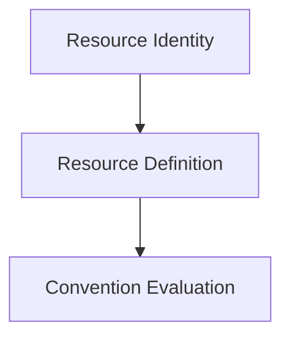

# Resource Definition

A Resource Definition describes the technical characteristics of a canonical resource
type, independently of any specific resource instance. Where
[Resource Identity](./resource-identity.md) describes *what a particular resource is*,
a Resource Definition describes *what a kind of resource can be* — the technical shape,
constraints, and valid deployment topology that every instance of that resource type
must respect.

## Purpose

**Purpose:** "What are the technical rules for this kind of resource, including where it
may or must exist?"

Resource Identity's Functional Identity plane includes a `resource_type` attribute —
the canonical technical resource kind (see [`resource-identity.md`](./resource-identity.md)).
A Resource Definition is the technical specification referenced by that `resource_type`.
It exists so that Convention Evaluation and adapters can apply resource-type-specific
rules consistently, instead of re-deriving them ad hoc for every resource.

## Responsibilities

A Resource Definition is conceptually responsible for describing a resource type's
canonical identifier, platform, and category, along with the identity constraints,
rendering constraints, and placement constraints that every instance of that resource
type must respect:

- **Canonical identifier** — the stable identifier for the resource type (the value used
  as `resource_type` in a Resource Identity).
- **Platform** — the infrastructure platform the resource type belongs to (for example,
  AWS, Azure, or Kubernetes).
- **Category** — a broader technical grouping the resource type belongs to (for example,
  storage, compute, networking).

### Identity constraints

Identity constraints define the identity characteristics of a resource type — whether
and how instances of it must be distinguished from one another:

- **Uniqueness** — whether names or identifiers for this resource type must be unique
  within an account, a region, a namespace, or globally.
- **Scope** — the administrative or isolation boundary within which uniqueness and other
  identity rules apply.
- **Global visibility** — whether the resource type is global or bound to a specific
  location, affecting whether `location` is meaningful for it.

### Rendering constraints

Rendering constraints define how a valid representation of the resource type must be
generated:

- **Technical constraints** — limits inherent to the resource type itself, such as
  maximum length, allowed characters, casing, and separators imposed by the underlying
  platform.
- **Normalization requirements** — how raw input must be transformed to produce a valid
  value for this resource type (for example, lower-casing, character substitution, or
  truncation rules).
- **Provider-specific capabilities** — technical capabilities or limitations specific to
  the platform or provider that Convention Evaluation must respect when generating
  outputs for this resource type.

A maximum length is only a portable constraint if every conforming Reference Evaluator
measures a generated name the same way. A Resource Definition that declares a maximum
length must therefore also declare the unit it counts, from a closed vocabulary:

- **Unicode code points** — the number of Unicode scalar values in the name, counting a
  character outside the Basic Multilingual Plane (for example, an emoji) as one unit
  regardless of how many UTF-16 code units it requires.
- **UTF-8 bytes** — the number of bytes in the name's UTF-8 encoding.

This vocabulary is closed to the two units above; it is not exhaustive of every unit a
resource type could in principle need (for example, UTF-16 code units or grapheme
clusters), and it is extended only when a real, supported resource type demonstrates the
need — never speculatively. The unit belongs to the Resource Definition, since it is the
resource type's own technical constraint, the same way the maximum length itself is; it
is never a Convention Pack concern, and Convention Evaluation never chooses a unit on the
Resource Definition's behalf.

### Executable Resource Constraints (Specification v1.2)

Specification v1.0/v1.1 named rendering constraints only in prose (`allowed_characters`
as free descriptive text) or partially (`max_length`/`length_unit`). Specification v1.2
adds the minimum structured, executable vocabulary demonstrated necessary by the AWS
Resource Definition catalog (see
[`docs/architecture/resource-definition-catalog-conformance.md`](../docs/architecture/resource-definition-catalog-conformance.md)),
without introducing a general-purpose expression or rule language. Every constraint
family below is optional; a Resource Definition populates only the families a real
provider fact demonstrates it needs (see [Version compatibility](#version-compatibility-specification-v12)
below for how these coexist with pre-v1.2 Resource Definitions).

#### Minimum length

`min_length` is a new, optional field, sharing `length_unit` with `max_length`:

- `min_length` and `max_length` share exactly one `length_unit`: a Resource Definition
  never declares two different units for the same rendered name.
- Whenever `min_length` **or** `max_length` is declared, `length_unit` must also be
  declared — the existing v1.1 invariant is widened to cover either bound, not only
  `max_length`.
- `min_length` is a non-negative integer. A value of `0` is valid but constrains
  nothing (every length, including an empty name, already satisfies "at least 0"); a
  Resource Definition with no real minimum simply omits `min_length` rather than
  declaring `0`.
- When both are declared, `min_length <= max_length` must hold; a Resource Definition
  that violates this invariant is itself malformed, independently of any rendered name.
- When only `min_length` is declared, a rendered name has no declared upper bound.
- When only `max_length` is declared, a rendered name has no declared lower bound
  (unchanged from Specification v1.1).
- When neither is declared, length is unconstrained by the Resource Definition (unchanged).
- A rendered name shorter than `min_length`, or longer than `max_length`, is invalid.
  Convention Evaluation never repairs it: no truncation, no padding, no substitution.
  Truncation remains conceptual only and is not introduced by this constraint (see
  [`docs/architecture/convention-evaluation-executability.md#length-and-truncation`](../docs/architecture/convention-evaluation-executability.md#length-and-truncation)).

Evidence: `aws_s3_bucket` documents a 3-character minimum bucket name length;
`aws_lambda_function`'s bare `FunctionName` documents a 1-character minimum (see
[`docs/architecture/resource-definition-catalog-conformance.md#min_length-gap`](../docs/architecture/resource-definition-catalog-conformance.md#min_length-gap)).

#### Character constraints

`allowed_characters` (a free descriptive `string`) is renamed, unchanged in meaning, to
**`allowed_characters_description`** — a purely illustrative, human-readable field that
is never interpreted as an executable grammar (see [`allowed_characters` migration](#allowed_characters-migration)
below). A new, optional, structured field, **`character_constraints`**, is introduced
alongside it for the executable representation:

- `character_constraints`, when declared, is composed of:
  - `classes` — zero or more members of a closed, deterministic, locale-insensitive
    vocabulary: `ascii_lowercase` (`a`–`z`), `ascii_uppercase` (`A`–`Z`),
    `ascii_letters` (the union of the two), `ascii_digits` (`0`–`9`). This vocabulary is
    closed to plain ASCII classes because no current catalog resource type demonstrates
    a need for a Unicode general category or a locale-sensitive class, and locale
    sensitivity would break cross-language determinism (see [Regex decision](#regex-decision)
    below). It is extended only when a real, cataloged resource type demonstrates a
    need for another class.
  - `literals` — zero or more individual, literal allowed characters (each exactly one
    Unicode code point), for characters a class does not already cover (for example,
    `.` and `-` for S3; `+`, `=`, `,`, `.`, `@`, `_`, `-` for IAM).
- The **allowed set** for a `character_constraints` value is the union of every code
  point covered by its declared `classes` and every code point listed in its `literals`.
  A code point appearing in more than one class, or listed more than once in `literals`,
  is not an error; duplicates have no effect on the union.
- **Every** code point in the rendered name must belong to the allowed set. A rendered
  name containing even one code point outside the allowed set is invalid.
- A `character_constraints` value with an empty allowed set (no `classes`, no
  `literals`) is malformed Resource Definition configuration — it can never admit any
  non-empty name — and must not be declared; a Resource Definition with no character
  constraint simply omits `character_constraints` entirely.
- `character_constraints` validates the rendered name only. It never changes how the
  name is generated — see [Validation and normalization remain separate](#validation-and-normalization-remain-separate)
  below.

##### Regex decision

Specification v1.2 does **not** adopt regular expressions as a normative executable
constraint representation, despite `aws_lambda_function`'s bare `FunctionName` pattern
being the strongest current evidence a regex-shaped grammar is feasible (a literal,
AWS-published `[a-zA-Z0-9-_]+`): regex dialects differ across languages (for example,
`\d` and Unicode-mode behavior differ between ECMAScript, PCRE, and RE2), and defining a
single, portable regex flavor precisely enough for two independently conforming
Reference Evaluator implementations to agree on every input would itself require
substantial new Specification work Milestone 3.3's evidence does not yet justify.
Critically, Lambda's own pattern needs no regex feature the structured character-class
model above cannot already express exactly: a fixed, unordered set of allowed
characters with no anchors, no quantifiers beyond simple repetition, and no
alternation — `ascii_letters` + `ascii_digits` + `literals: ["-", "_"]` represents it
precisely. Since every character constraint demonstrated by the current catalog (S3,
IAM, Lambda) reduces to a plain character set, the smaller structured model is
preferred over adopting an undefined regex dialect. This decision may be revisited if a
future cataloged resource type demonstrates a character grammar the structured class
model cannot represent (for example, a rule genuinely requiring alternation or
repetition counts) — not speculatively.

#### Start/end constraints

`starts_with` and `ends_with` are new, optional fields, each using the same
allowed-set model as `character_constraints` above (a `classes`/`literals` pair):

- `starts_with`, when declared, requires the rendered name's **first** code point to
  belong to its allowed set.
- `ends_with`, when declared, requires the rendered name's **last** code point to belong
  to its allowed set.
- An empty rendered name never satisfies a declared `starts_with` or `ends_with`
  constraint (there is no first or last code point to check); this is a validation
  failure like any other, not a special case.
- `starts_with` and `ends_with` are independent: a Resource Definition may declare
  either, both, or neither. When both are declared and the rendered name is exactly one
  code point long, that single code point must satisfy both constraints.

Evidence: `aws_s3_bucket` documents "must begin and end with a letter or number." A
structured `starts_with`/`ends_with` pair using `classes: [ascii_letters, ascii_digits]`
represents this exactly, without resorting to regex.

#### Reserved prefixes and suffixes

`forbidden_prefixes` and `forbidden_suffixes` are new, optional fields: each a list of
exact literal strings.

- Matching is **exact-string, case-sensitive prefix or suffix matching** — no pattern,
  wildcard, or regular expression. A rendered name is invalid if it starts with any
  entry of `forbidden_prefixes`, or ends with any entry of `forbidden_suffixes`.
- An empty string is never a valid entry in either list — a Resource Definition must
  not declare one, since every name trivially starts and ends with the empty string,
  making the constraint always fail.
- An absent or empty `forbidden_prefixes`/`forbidden_suffixes` means no prefix/suffix is
  reserved.
- Checking is deterministic: every declared entry is checked, in declaration order, and
  every match is reported (see [Constraint validation order](#constraint-validation-order-specification-v12)
  below for ordering relative to other constraint families); this document does not
  require an evaluator to stop at the first match.

Evidence: S3 general purpose buckets reserve prefixes and suffixes such as `xn--`,
`sthree-`, and `-s3alias`.

#### Deferred reserved-pattern rules

Not every S3 reserved-name rule is representable by `forbidden_prefixes`/
`forbidden_suffixes` alone. Classifying each current provider rule:

| Rule | Classification |
| --- | --- |
| Reserved prefixes (for example, `xn--`, `sthree-`) | A. Covered by `forbidden_prefixes`. |
| Reserved suffixes (for example, `-s3alias`) | A. Covered by `forbidden_suffixes`. |
| Must not be formatted as an IPv4 address | B. Deferred — no structured constraint in this version represents "resembles an IPv4 address"; introducing one would require either a dedicated, closed constraint kind or a general pattern language, and Milestone 3.3's evidence supports only one concrete case. |
| Adjacency restrictions (for example, no two adjacent periods) | B. Deferred — same reasoning; a general adjacency/sequence constraint is not introduced speculatively for one provider rule. |

A partial, coherent, evidence-backed constraint model is preferred over a generic rule
language that could represent every S3 rule at the cost of becoming the universal rule
engine this version explicitly rejects (see
[Non-goals](../README.md#specification-v12-non-goals)). The two deferred rules above
remain documented only, exactly as they were before this version (see
[`docs/architecture/resource-definition-catalog-conformance.md#reserved-pattern-gap`](../docs/architecture/resource-definition-catalog-conformance.md#reserved-pattern-gap)).

#### Validation and normalization remain separate

Every constraint introduced in this section is a **validator**: it checks whether an
already-generated rendered name is valid. None of them is a normalization instruction.
In particular:

- A `character_constraints` value admitting only `ascii_lowercase` does not mean
  Convention Evaluation lowercases the rendered name — Convention Pack `casing` (see
  [`convention-pack.md#casing`](./convention-pack.md#casing)) remains the only
  normative source of a casing transformation, and it runs before validation, as an
  independent Convention Pack policy.
- `starts_with`/`ends_with`/`forbidden_prefixes`/`forbidden_suffixes` never trim,
  substitute, or otherwise alter the rendered name; a violation is reported as a
  validation failure, unmodified.
- `min_length`/`max_length` never truncate or pad; an out-of-range name is reported
  invalid and retained exactly as generated (unchanged from Specification v1.1's
  existing `max_length` behavior).

This boundary — Convention Pack policy generates a name; Resource Definition
constraints only validate it — is unchanged by this version; it is restated here
because the new constraint families make the distinction easy to blur in practice.

### Placement Constraints

Placement Constraints describe the valid deployment topology for a resource type — not
only where a resource of this type may or must exist, but also how it must relate to
other resources it depends on. They belong to the resource type itself, independently of
any organization, platform convention, or deployment convention: the same resource type
carries the same Placement Constraints no matter which Convention Pack names it.

Placement Constraints may express concepts such as:

- global resources, with no meaningful `location`;
- regional resources, bound to a specific `location`;
- account-scoped, subscription-scoped, namespace-scoped, or cluster-scoped resources;
- co-location requirements with another resource (for example, requiring a certificate
  to be deployed in the same region as the service that consumes it);
- provider-specific placement restrictions;
- conditional placement rules, where the required placement depends on how the resource
  is used or which other resource it is associated with;
- required deployment scope characteristics, such as a specific administrative or
  isolation boundary.

Some placement rules are conditional rather than fixed — for example, an AWS ACM
Certificate is normally regional, but must exist in `us-east-1` specifically when it is
associated with a CloudFront Distribution. See
[Illustrative examples](#illustrative-examples) below for further, purely conceptual
examples; this document does not define a provider catalog.

#### Structured Placement Constraints (Specification v1.2)

Specification v1.0/v1.1 represented `placement_constraints` as a flat
`ReadonlyArray<string>` of free-form descriptive statements — sufficient to describe a
rule in prose, but not to execute it. Specification v1.2 evolves this shape, replacing
the bare string array with a list of **Placement Constraint** entries (see
[`placement_constraints` migration](#placement_constraints-migration) below for
compatibility). Each entry always carries:

- **`statement`** — the human-readable descriptive text (the same content the v1.0/v1.1
  free-form strings already carried); always present, since every Placement Constraint
  remains meaningful to a human reader even when it cannot be executed.
- **`rule`** — an optional structured, executable representation of the same statement,
  present only when the constraint can be evaluated from Resource Identity alone (see
  [The conditional-input problem](#the-conditional-input-problem) below). A Placement
  Constraint with no `rule` remains exactly as executable as a v1.1 free-form string —
  descriptive only.

##### Placement subject

A Placement Constraint validates the resolved **Resource Identity**, exactly as
[Relationship with Resource Identity](#relationship-with-resource-identity) below
already states. `deployment.location` (a canonical Resource Identity attribute
reference, see
[`resource-identity.md#canonical-attribute-references`](./resource-identity.md#canonical-attribute-references))
remains the sole canonical resource location. A structured Placement Constraint `rule`
never duplicates or sets `deployment.location`; it only references it, the same way a
naming rule references a canonical attribute without owning it.

##### Placement operator vocabulary

When a Placement Constraint declares a `rule`, the rule's `subject` is a canonical
Resource Identity attribute reference, and its `operator` is one of a small, closed
vocabulary:

- **`equals`** — the subject's resolved value must equal a declared literal `value`.
- **`present`** — the subject must have a resolved value (any value).
- **`absent`** — the subject must have no resolved value.

No other operator (`regex`, arithmetic comparison, `contains`, `startsWith`, or an
arbitrary boolean expression tree) is introduced: no current catalog evidence
demonstrates a need for one, and introducing a richer vocabulary speculatively would
begin building exactly the generic rule engine this version rejects (see
[Non-goals](../README.md#specification-v12-non-goals)).

##### The conditional-input problem

The ACM/CloudFront example requires a fact Resource Identity does not contain: whether
the certificate is *associated with* (consumed by) a CloudFront distribution. This is a
relationship between two resources, not an attribute of the certificate's own Resource
Identity, Governance Context, or Evaluation Context as currently defined anywhere in the
Specification.

Three options were evaluated:

- **A. Introduce a small Evaluation Context relationship concept** — rejected for this
  version: no current Specification document defines resource-to-resource relationships
  at all (see [`context-resolution.md#evaluation-context`](./context-resolution.md#evaluation-context)),
  and inventing one to satisfy a single example would be exactly the kind of speculative
  conceptual expansion [Specification Evolution](../AGENTS.md#specification-evolution)
  warns against.
- **B. Treat consumer/resource relationships as explicit evaluator input** — rejected for
  the same reason: this would still require a new canonical input the Specification does
  not yet define, only relocated from Evaluation Context to a bespoke evaluator
  parameter.
- **C. Defer conditional Placement Constraint execution until the relationship model
  exists** — **adopted**. A structured Placement Constraint `rule`'s `condition`, when
  present, may only reference a canonical Resource Identity or Governance Context
  attribute using the same `equals`/`present`/`absent` operator vocabulary as the rule
  itself. Since "associated with a CloudFront distribution" is not such an attribute,
  the ACM Certificate's own Placement Constraint **cannot** declare a `rule` for its
  conditional half in this version — it remains `statement`-only, exactly as
  non-executable as it was under Specification v1.1. See
  [`aws_acm_certificate`](#aws-acm-certificate) below for how this renders in
  the illustrative example.

**This is a stated blocker, not a partial implementation**: Specification v1.2 defines
the structured Placement Constraint shape only as far as it can be evaluated from
canonical inputs that already exist. A conditional relationship such as "consumed by
CloudFront" remains unrepresentable until a future Specification version defines a
canonical source for it.

##### Conditional composition

A structured Placement Constraint `rule` supports **at most one** `condition`, itself
built from exactly one canonical-attribute check (subject, operator, optional value) —
there is no `AND`, `OR`, or nested group. A single ACM/CloudFront-shaped example is the
only evidence for a condition at all, and it is not even executable today (see above);
building a boolean-expression composition language for one non-executable case would be
purely speculative. When a `rule` declares no `condition`, it applies unconditionally.

##### Provider literals, never provider branches

A Placement Constraint's `rule` may contain a provider-specific literal `value` (for
example, `"us-east-1"`) as ordinary Resource Definition data — the same way `max_length`
already contains a provider-specific number. The Reference Evaluator's own code must
never branch on a `resource_type` or a provider literal (for example, code equivalent to
`if resource_type == "aws_acm_certificate" && ...`): it only interprets the generic
`subject`/`operator`/`value` structure described above, exactly as it already interprets
`max_length` without knowing which resource type declared it.

This list describes the conceptual responsibilities of a Resource Definition. It is not
an exhaustive attribute list, and no schema is defined for it yet.

## ResourceType semantic variants (Specification v1.2)

A `ResourceType` identifies **one stable set of technical Resource Definition
semantics** — its namespace, naming grammar, uniqueness scope, placement semantics, and
technical constraints. This is a formalization, not a redesign: it captures the
architecture principle Milestone 3.3 already established in practice for
`aws_s3_bucket` (see
[`docs/architecture/resource-definition-catalog-conformance.md#s3-namespace-finding-and-resourcetype-boundary`](../docs/architecture/resource-definition-catalog-conformance.md#s3-namespace-finding-and-resourcetype-boundary)).

A provider may expose two resources through what looks like "the same API
 operation" — the same create call, the same management console entry — while a
creation-time, provider-defined configuration choice gives them materially different:

- namespaces (for example, a namespace scoped per partition versus per
  Availability/Local Zone);
- naming grammars (for example, an additional mandatory suffix, or a stricter
  character set);
- uniqueness scopes;
- placement semantics;
- technical constraints.

When a provider's own documentation demonstrates this — not repository intuition —
these must be modeled as **distinct canonical `ResourceType`s**, never recombined into
one `ResourceDefinition` using conditional constraints. The concrete evidence:
`aws_s3_bucket` denotes the **general purpose bucket** variant only, permanently; a
future S3 **directory bucket** would require its own `ResourceType` (for example,
`aws_s3_directory_bucket`), because it has a materially different namespace (unique per
Availability/Local Zone, not per partition), a mandatory zone-scoped name suffix, a
stricter character grammar (no periods), and additional reserved patterns. A structured
conditional constraint (see
[Structured Placement Constraints](#structured-placement-constraints-specification-v12)
above) must never be used to fold a general purpose bucket and a directory bucket back
into one `ResourceType` — the two are not "the same resource, used differently"; they
are different provider-defined resource kinds.

### Distinguishing a ResourceType variant from a conditional constraint

This is a different situation from a **conditional constraint**, where the resource
remains the same `ResourceType`, but a constraint's required value depends on another
relationship or usage context:

| | ResourceType variant | Conditional constraint |
| --- | --- | --- |
| Cause | A provider-defined, creation-time configuration choice defines a materially different resource kind. | The same resource is used or related differently by context. |
| Example | S3 general purpose bucket vs. S3 directory bucket. | An ACM Certificate, normally regional, but requiring `us-east-1` when consumed by CloudFront. |
| Representation | Distinct `ResourceType`s, each with its own `ResourceDefinition`. | One `ResourceType`, with a conditional Placement Constraint (see [Structured Placement Constraints](#structured-placement-constraints-specification-v12) above). |

Do not blur these two cases: a materially different provider resource kind is never
recombined into one `ResourceType` via a condition, and a genuine usage-context
difference for the *same* resource kind is never split into two `ResourceType`s.

## Relationship with Resource Identity

A Resource Definition is selected through Resource Identity's Functional Identity plane:

```text
Resource Identity
    -> functional.resource_type
        -> Resource Definition
```

`resource_type` is the link between the two models: Resource Identity identifies a
specific resource, and its `resource_type` value selects the Resource Definition that
describes the technical rules that resource must follow. Resource Identity remains
canonical and independent — it does not embed a Resource Definition's technical details
directly; it only references one by `resource_type`.

This selection happens once Resource Identity has been completed. Resource Definition
lookup is independent of [Context Resolution](./context-resolution.md): Context
Resolution produces Resource Identity and Governance Context only, and does not itself
select or resolve a Resource Definition.

`deployment.location` continues to belong to Resource Identity (see
[`resource-identity.md`](./resource-identity.md#plane-2-deployment-identity)): Resource
Identity defines the resource's canonical deployment location. Placement
Constraints define whether that location is valid for the selected resource type — they
never replace or duplicate it. For example, a Resource Identity with
`deployment.location: us-east-1` satisfies an AWS ACM Certificate's Placement Constraint
that requires `us-east-1` when the certificate is associated with CloudFront, while a
different `deployment.location` value would not. Convention Evaluation validates this
relationship; the Resource Definition itself never changes Resource Identity.

## Relationship with Convention Evaluation

Convention Evaluation consults a resource's Resource Definition, alongside its
[Resource Identity](./resource-identity.md) and [Governance Context](./governance-context.md),
when evaluating conventions and generating outputs. Technical constraints declared by
the Resource Definition (for example, maximum name length or allowed characters)
constrain how Convention Evaluation generates a name, and inform the validation and
warnings included in the resulting [Convention Result](./convention-result.md).

Convention Evaluation validates Placement Constraints exactly as it already validates
technical constraints, normalization, and uniqueness: it checks that the resolved
Resource Identity satisfies the Placement Constraints declared by the selected Resource
Definition, and reports a validation failure or warning in the Convention Result when it
does not. Convention Evaluation does not invent placement; it only validates a
relationship the Resource Definition already declares.

### Constraint validation order (Specification v1.2)

Convention Evaluation validates a rendered name's Resource Definition constraints, when
declared, in the following deterministic order, so that two independently conforming
Reference Evaluator implementations report the same outcome for the same input:

1. `min_length`
2. `max_length`
3. `character_constraints`
4. `starts_with` / `ends_with`
5. `forbidden_prefixes` / `forbidden_suffixes`
6. Placement Constraints with an executable `rule`

This order proceeds from the coarsest, cheapest check (a single length comparison) to
progressively finer-grained checks (individual code points, then whole-name boundary
and reserved-pattern checks), and validates the rendered name's own shape completely
before validating the resolved Resource Identity's deployment topology, which is a
distinct concern from the name's shape. `ConventionResult.validation.failures` reports
every violated constraint, not only the first — ordering determines the deterministic
*sequence* of `ConventionValidationFailure` entries, not which ones are reported (see
[`convention-result.md#conceptual-contents`](./convention-result.md#conceptual-contents)).
A Placement Constraint with no executable `rule` (see [The conditional-input
problem](#the-conditional-input-problem) above) contributes no automated validation
outcome; it remains descriptive only.

Steps 4, 5, and 6 each combine more than one constraint family or entry; within each,
the following sub-order is also normative, so that no combined step is itself
ambiguous between two independently conforming implementations:

- Within step 4, `starts_with` is evaluated before `ends_with`.
- Within step 5, `forbidden_prefixes` is evaluated before `forbidden_suffixes`; within
  each of those two fields, its entries are themselves evaluated in declaration order,
  unchanged from [Reserved prefixes and suffixes](#reserved-prefixes-and-suffixes)
  above.
- Within step 6, `PlacementConstraint` entries are evaluated in the declaration order
  of the `placement_constraints` array.

This sub-ordering is, like the top-level order above, only about the deterministic
*sequence* of reported `ConventionValidationFailure` entries: it changes no
constraint's success or failure, no failure `code`, and no other Specification v1.2
behavior.

### Validation behavior and failure semantics (Specification v1.2)

Every constraint introduced by this version is a validator, consistent with
[Validation and normalization remain separate](#validation-and-normalization-remain-separate)
above: a violation always sets `ConventionResult.validation.valid` to `false` and
produces one or more deterministic `ConventionValidationFailure` entries. Convention
Evaluation never automatically transforms the generated output in response to a
violation — no truncation, no sanitization, no substitution, no automatic prefix or
suffix removal.

**Failure codes.** Specification v1.1's `ConventionValidationFailure` carried only a
human-readable message. Specification v1.2 adds a small, closed, optional `code` field
to `ConventionValidationFailure`, one value per new constraint family, so that two
independent Reference Evaluator implementations can compare validation outcomes
programmatically rather than by string-matching a human-readable message — directly
serving this repository's own Adapter Consistency principle
(see [`AGENTS.md`](../AGENTS.md#architectural-principles)), which becomes materially
more valuable now that several distinct, structured constraint families exist instead
of one (`max_length`). The closed vocabulary is:

| Code | Meaning |
| --- | --- |
| `min-length` | The rendered name is shorter than `min_length`. |
| `max-length` | The rendered name is longer than `max_length`. |
| `character-constraint` | The rendered name contains a code point outside `character_constraints`' allowed set. |
| `starts-with` | The rendered name's first code point does not satisfy `starts_with`. |
| `ends-with` | The rendered name's last code point does not satisfy `ends_with`. |
| `forbidden-prefix` | The rendered name starts with an entry of `forbidden_prefixes`. |
| `forbidden-suffix` | The rendered name ends with an entry of `forbidden_suffixes`. |
| `placement` | The resolved Resource Identity does not satisfy an executable Placement Constraint `rule`. |

`code` remains optional and additive: a `ConventionValidationFailure` produced for a
reason this vocabulary does not cover (for example, required-attribute completeness,
already implemented under Specification v1.1) carries no `code`, exactly as before.

## Relationship with Convention Pack and Platform Convention

A [Convention Pack](./convention-pack.md) — including a
[Platform Convention](./policies/platform-convention.md) it may compose — may reference or
declare compatibility with a Resource Definition, but it does not replace or duplicate
the technical constraints a Resource Definition declares. Maximum name length, allowed
characters, uniqueness scope, normalization requirements, and Placement Constraints
remain Resource Definition responsibilities regardless of which Convention Pack,
Platform Convention, Organization Convention, or Deployment Convention applies to a
resource.

A Convention Pack may provide identity defaults, project metadata, and require
attributes, but it must never decide placement. For example, a Convention Pack must not
encode a rule such as "CloudFront certificates must be in `us-east-1`" — that rule
belongs exclusively to the AWS ACM Certificate's Resource Definition, since it is a
property of the resource type itself, not of any organization's or product's naming
convention.

## Illustrative examples

The following examples are conceptual only and do not define a provider catalog (see
[Out of scope for this document](#out-of-scope-for-this-document) below). They
illustrate Specification v1.2 constructs using the same four AWS resource types already
cataloged in `packages/catalog/src/aws/`, without themselves becoming an AWS catalog —
see [Catalog impact plan](#catalog-impact-plan-non-normative) below for how each actual
cataloged `ResourceDefinition` would map.

### S3 Bucket

Rendering constraints (illustrative — general purpose bucket variant only, see
[ResourceType semantic variants](#resourcetype-semantic-variants-specification-v12) above):

- `min_length: 3`, `max_length: 63`, `length_unit: code_points`;
- `character_constraints`: `classes: [ascii_lowercase, ascii_digits]`,
  `literals: [".", "-"]`;
- `starts_with` / `ends_with`: `classes: [ascii_lowercase, ascii_digits]`;
- `forbidden_prefixes: ["xn--", "sthree-"]`, `forbidden_suffixes: ["-s3alias"]`
  (illustrative subset; not exhaustive).

Placement Constraints:

- `statement: "regional; location chosen by the deployment"`, no `rule` (an
  unconditional "any resolved location is valid" rule adds no validation value over
  declaring no Placement Constraint at all).

### IAM Role

Rendering constraints (illustrative):

- `max_length: 64`, `length_unit: code_points` (no documented minimum; `min_length` is
  correctly omitted, not fabricated as `1`);
- `character_constraints`: `classes: [ascii_letters, ascii_digits]`,
  `literals: ["+", "=", ",", ".", "@", "_", "-"]`.

Placement Constraints:

- `statement: "global within the deployment scope (AWS account)"`, no `rule` (globality
  is already expressed by `identity_constraints.global: true`; a placement `rule` would
  duplicate it without adding executable value).

### Lambda Function

Rendering constraints (illustrative):

- `min_length: 1`, `max_length: 64`, `length_unit: code_points`;
- `character_constraints`: `classes: [ascii_letters, ascii_digits]`,
  `literals: ["-", "_"]` — the structured equivalent of AWS's own published
  `[a-zA-Z0-9-_]+` pattern for the bare function name (see [Regex
  decision](#regex-decision) above).

Placement Constraints:

- `statement: "regional; location chosen by the deployment"`, no `rule` (same reasoning
  as S3 Bucket above).

### AWS ACM Certificate

No `rendering_constraints` (unchanged: `RequestCertificate` never accepts a
user-supplied name).

Placement Constraints — two entries, illustrating a statement that *can* be executed
unconditionally and one that remains blocked on the conditional-input problem:

- `statement: "regional; the deployment chooses the Region, except when associated
  with a CloudFront distribution"`, no `rule` (this entry only restates the general
  case; declaring an unconditional `rule` here would misrepresent the exception the
  statement itself names);
- `statement: "must be us-east-1 when associated with a CloudFront distribution,
  overriding the general regional rule above"`, no `rule` — this is the entry blocked
  by [The conditional-input problem](#the-conditional-input-problem) above: no
  canonical Resource Identity or Governance Context attribute currently represents
  "associated with a CloudFront distribution," so this remains descriptive only, exactly
  as it was under Specification v1.1.

### Route53 Hosted Zone

Placement Constraints:

- `statement: "global"`, no `rule`.

### Azure Front Door

Placement Constraints:

- `statement: "provider-specific placement constraints"`, no `rule`.

These examples illustrate the kind of rule a Resource Definition may declare; they are
not an exhaustive or normative catalog, and none of them modifies the actual
`packages/catalog/src/aws/` entries (see [Catalog impact plan](#catalog-impact-plan-non-normative)
below).

## Normative test vectors (Specification v1.2)

The following provider-neutral vectors illustrate the constraint semantics defined
above, using a hypothetical Resource Definition with `min_length: 3`, `max_length: 10`,
`length_unit: code_points`, `character_constraints: { classes: [ascii_lowercase,
ascii_digits] }`, `starts_with: { classes: [ascii_lowercase] }`, `ends_with: {
classes: [ascii_lowercase, ascii_digits] }`, `forbidden_prefixes: ["xn--"]`,
`forbidden_suffixes: ["-tmp"]`:

| Rendered name | Outcome | Reason |
| --- | --- | --- |
| `abc` | Valid | Exactly at `min_length` (3 code points). |
| `ab` | Invalid (`min-length`) | One below `min_length`. |
| `abcdefghij` | Valid | Exactly at `max_length` (10 code points). |
| `abcdefghijk` | Invalid (`max-length`) | One above `max_length`. |
| `abc123` | Valid | Every code point is `ascii_lowercase` or `ascii_digits`. |
| `abc_123` | Invalid (`character-constraint`) | `_` is outside the allowed set. |
| `abc123` | Valid (start/end) | Starts with `a` (`ascii_lowercase`); ends with `3` (`ascii_digits`). |
| `1bc123` | Invalid (`starts-with`) | Starts with `1`, not `ascii_lowercase`. |
| `xn--abc` | Invalid (`forbidden-prefix`) | Starts with the reserved prefix `xn--`. |
| `abc-tmp` | Invalid (`forbidden-suffix`) | Ends with the reserved suffix `-tmp`. |

No Placement Constraint vector is added: the only structured condition example this
version analyzes (ACM/CloudFront) is explicitly non-executable (see [The
conditional-input problem](#the-conditional-input-problem) above), and inventing an
artificial relationship model solely to produce a vector would contradict this
version's own evidence-driven design rule.

## Version compatibility (Specification v1.2)

Specification v1.2 is additive for every rendering-constraint field except
`allowed_characters`, and is a deliberate shape change for `placement_constraints`, both
chosen because this project is still pre-release (see
[`specification/README.md#specification-status`](./README.md#specification-status)) and
no external Resource Definition consumer holds a compatibility promise across either
field yet — the same reasoning Specification v1.1 already applied to its own
`abbreviations` reshape (see
[`README.md#delta-from-specification-v10`](./README.md#delta-from-specification-v10)).

### `allowed_characters` migration

`allowed_characters: string` is renamed to `allowed_characters_description`, with
identical descriptive-only meaning — Option B from the candidates the task considered
(rename the prose field to something clearly non-executable), rather than Option A
(overloading the same field to sometimes mean prose and sometimes mean an executable
grammar) or Option C (keeping the ambiguous name with a deprecation note). A single
field whose type means both "human-readable prose" and "executable syntax" is never
acceptable; the rename removes that ambiguity permanently. The new, optional,
executable `character_constraints` field (see [Character
constraints](#character-constraints) above) is the only field Convention Evaluation may
treat as executable.

### `placement_constraints` migration

`placement_constraints: ReadonlyArray<string>` is replaced by
`placement_constraints: ReadonlyArray<PlacementConstraint>`, where each
`PlacementConstraint` is `{ statement: string; rule?: <structured rule> }` (see
[Structured Placement Constraints](#structured-placement-constraints-specification-v12)
above). This is a full migration, not a coexistence of two competing representations: a
v1.1 free-form string becomes a v1.2 entry's `statement`, unchanged in content, with no
`rule` unless the condition described above is met. No Resource Definition may declare a
bare string alongside a structured entry in the same list.

## Catalog impact plan (non-normative)

This section documents, without changing, how each of the four currently cataloged AWS
`ResourceDefinition`s (`packages/catalog/src/aws/`) would map onto Specification v1.2.
No catalog TypeScript file is modified by this Specification change; this is the input
for a later implementation PR.

| Resource type | Newly representable | Still deferred | Migration required |
| --- | --- | --- | --- |
| `aws_s3_bucket` | `min_length: 3`; structured `character_constraints`; `starts_with`/`ends_with`; `forbidden_prefixes`/`forbidden_suffixes` (partial — see [Deferred reserved-pattern rules](#deferred-reserved-pattern-rules)) | IPv4-shaped names; adjacency restrictions | Rename `allowed_characters` to `allowed_characters_description`; convert its one `placement_constraints` string to a `PlacementConstraint` object |
| `aws_iam_role` | Structured `character_constraints` | `path` (still deferred; see [IAM path design gate](#iam-path-design-gate-non-normative) below) | Same two migrations as `aws_s3_bucket` |
| `aws_lambda_function` | `min_length: 1`; structured `character_constraints` (equivalent to AWS's own published regex, see [Regex decision](#regex-decision)) | None newly identified | Same two migrations |
| `aws_acm_certificate` | Nothing newly representable — it declares no `rendering_constraints`, and its conditional placement rule remains non-executable (see [The conditional-input problem](#the-conditional-input-problem)) | The CloudFront condition itself | Convert its two `placement_constraints` strings to two `PlacementConstraint` objects, neither with a `rule` |

### IAM path design gate (non-normative)

Running IAM's `path` through this version's own evidence-driven design questions:

1. Is `path` part of the canonical resource name produced by this project's
   conventions? No — it is a separate provider property.
2. Is it part of Resource Identity? No — no current Resource Identity attribute
   represents it.
3. Is it a separate provider property an adapter supplies independently? Yes — this is
   the only "yes" among the five questions.
4. Does `ConventionResult` need to output it? Not demonstrated by any current evidence.
5. Does any current second resource demonstrate the same abstraction? No — IAM's
   `path` remains the only example.

**Result: deferred.** The evidence demonstrates only a provider configuration property,
not a Resource Definition domain-boundary need; `ResourceDefinition` is not widened into
a schema for every provider input. This mirrors Milestone 3.3's own P1 flag without
resolving it (see
[`docs/architecture/resource-definition-catalog-conformance.md#path-and-secondary-identifier-gap`](../docs/architecture/resource-definition-catalog-conformance.md#path-and-secondary-identifier-gap)).

## Unchanged by Specification v1.2

The following, evaluated explicitly against Milestone 3.3's evidence, are **not**
redesigned by this version, because no current evidence demonstrates the existing model
is insufficient:

- **`uniqueness_scope`** — remains a free-form `string` (P2; see
  [`docs/architecture/resource-definition-catalog-conformance.md#uniqueness-scope-vocabulary-review`](../docs/architecture/resource-definition-catalog-conformance.md#uniqueness-scope-vocabulary-review)).
- **`global`** — remains a plain `boolean`; Milestone 3.3 found both cataloged values
  (`true` for `aws_iam_role`, `false` for `aws_s3_bucket`) already sufficient (see
  [`docs/architecture/resource-definition-catalog-conformance.md#globality-model-review`](../docs/architecture/resource-definition-catalog-conformance.md#globality-model-review)).
- **IAM `path` / secondary identifiers** — deferred; see [IAM path design
  gate](#iam-path-design-gate-non-normative) above.

## Out of scope for this document

This document defines the *concept* of a Resource Definition only. It intentionally does
not:

- Define an actual catalog of resource types.
- Define concrete AWS, Azure, or Kubernetes resource types.
- Define a JSON Schema for Resource Definitions (evaluated again for Specification
  v1.2 — see [Schema impact](./README.md#specification-v12-schema-impact) — and
  deliberately not added).
- Define a general pattern/regex grammar (see [Regex decision](#regex-decision) above).
- Define provider SDK integration, provider catalog discovery, or additional provider
  coverage.
- Define a canonical resource-to-resource relationship model (see [The
  conditional-input problem](#the-conditional-input-problem) above).

These are left for a later iteration of the Specification, once further implementation
evidence justifies them.

## Where Resource Definition fits


```mermaid
flowchart TD
    RI["Resource Identity"] --> RD["Resource Definition"]
    RD --> CE["Convention Evaluation"]
```

This is a focused view of the pipeline described in
[`specification/README.md`](./README.md#architecture); it shows only how Resource
Definition relates to Resource Identity and Convention Evaluation. The arrow from
Resource Identity to Resource Definition represents a lookup by `resource_type`, not a
processing stage — the only processing stages in the Specification are Context
Resolution and Convention Evaluation.
