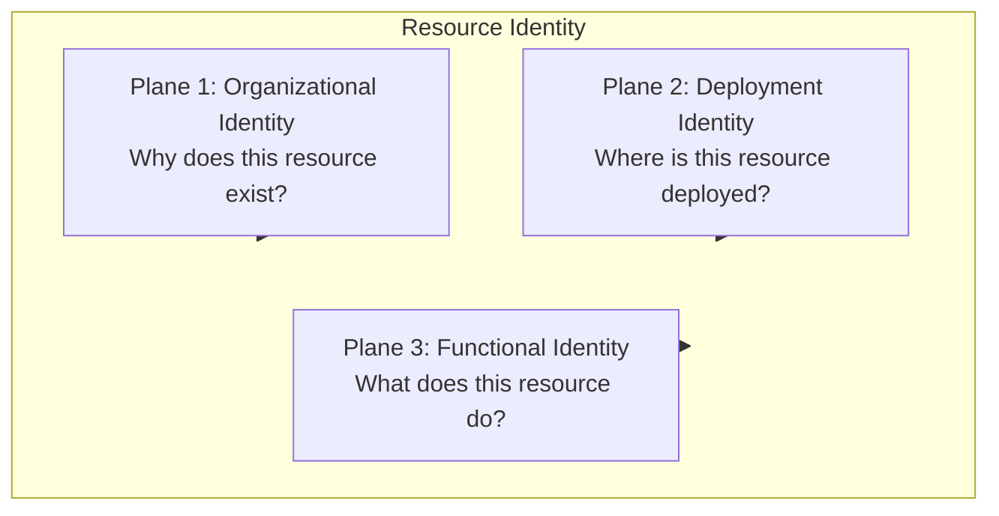

# Resource Identity

Resource Identity is the canonical domain model used to describe *what a resource is* in
a way that is independent of any cloud provider, tool, or naming syntax. It is the shared
vocabulary that every adapter — Terraform, AWS CDK, Ansible, the CLI, and any future
adapter — builds upon.

Resource Identity organizes the information about a resource into three **identity
planes**. Each plane answers a distinct question about the resource and groups together
attributes that tend to change — or not change — at the same rate.

Resource Identity does not include ownership, cost allocation, or operational policy
information. That concern is modeled independently in
[Governance Context](./governance-context.md), so operational policy can evolve without
changing the canonical identity.

## Plane 1: Organizational Identity

**Purpose:** "Why does this resource exist?"

Organizational Identity captures the organizational context a resource belongs to —
the business or organizational reason for its existence, independent of where or how it
is deployed.

Possible attributes:

- `organization`: Enterprise, company, legal entity, or top-level owner of the resource.
- `business_unit`: Organizational area responsible for or funding the system.
- `system`: Software system, product, or business application to which the resource belongs.
- `tenant`: Optional customer or logical tenant associated with the resource.

These attributes are highly stable. They rarely change over the lifetime of a resource,
because they describe organizational placement rather than technical or operational
details.

## Plane 2: Deployment Identity

**Purpose:** "Where is this resource deployed?"

Deployment Identity captures where a resource lives: the platform, the deployment
boundary within that platform, and the environment and location within that boundary.

Possible attributes:

- `platform`: Infrastructure platform derived from the resource type, resource definition, or adapter.
- `deployment_scope`: Logical identifier for the administrative or isolation boundary where the resource is deployed, such as an AWS account alias, Azure subscription alias, or Kubernetes cluster name.
- `environment`: Lifecycle stage or operational environment in which the resource is used.
- `location`: Logical or physical deployment location when the resource is not global.
- `instance`: Optional discriminator used when multiple equivalent instances of a resource exist.

`platform` is part of the canonical resolved identity, but it is normally derived from
the resource type, resource definition, or adapter rather than repeatedly provided by
the caller.

`deployment_scope` is a logical identifier, not the provider's immutable technical ID.
Prefer `workload-prod` over an AWS account ID, `shared-services` over an Azure
subscription UUID, or `production-eu` over a Kubernetes cluster UID.

Some resources are global and therefore do not require `location`. A Convention Pack or
profile determines whether `deployment_scope`, `environment`, or `location` are required
for a given resource.

## Plane 3: Functional Identity

**Purpose:** "What does this resource do?"

Functional Identity describes the purpose and role of the resource within the systems it
belongs to.

Possible attributes:

- `service`: Logical workload, subsystem, or deployable capability within the system.
- `component`: Optional functional role or subcomponent within the service.
- `resource_type`: Canonical technical resource kind used to select its
  [Resource Definition](./resource-definition.md) and constraints.

`service` is intentionally broader than a microservice: it may represent a workload, a
subsystem, a logical service, a deployable capability, or another functional unit within
the system. `component` is optional. `resource_type` remains the technical resource kind.
The selected Convention Pack determines which of these attributes are required for a
given resource.

The simplified hierarchy is:

```text
organizational.system
└── functional.service
    └── functional.component
        └── functional.resource_type
```

Not every level must be present. A minimal example:

```yaml
organizational:
  system: telemetry-platform

functional:
  service: ingestion
  resource_type: aws_s3_bucket
```

A more detailed example:

```yaml
organizational:
  system: telemetry-platform

functional:
  service: ingestion
  component: storage
  resource_type: aws_s3_bucket
```

### `system` versus `service`

`organizational.system` identifies the software system, product, or business
application that owns the resource. `functional.service` identifies the workload,
subsystem, or deployable capability within that system.

### `service` versus `component`

`service` identifies the logical workload or capability. `component` identifies an
optional role or subcomponent within that service.

### `component` versus `resource_type`

`component` describes the functional role. `resource_type` describes the canonical
technical resource kind.

## Relationships between the three identity planes

Each identity plane answers a distinct question about a resource, and together they
compose the complete Resource Identity:



## Resource Identity is the canonical internal model

Resource Identity is the complete, canonical representation of a resource's identity
once the three identity planes have been resolved. It is the model the Convention Engine
operates on internally, and the model every adapter ultimately consumes to render names,
tags, labels, and annotations.

Resource Identity is **not** the public API. Users of the Specification do not construct
a full Resource Identity by hand; they submit a much smaller request, described in
[`naming-request.md`](./naming-request.md), which is resolved into a Resource Identity
alongside a separate [Governance Context](./governance-context.md) by the Convention
Engine.
