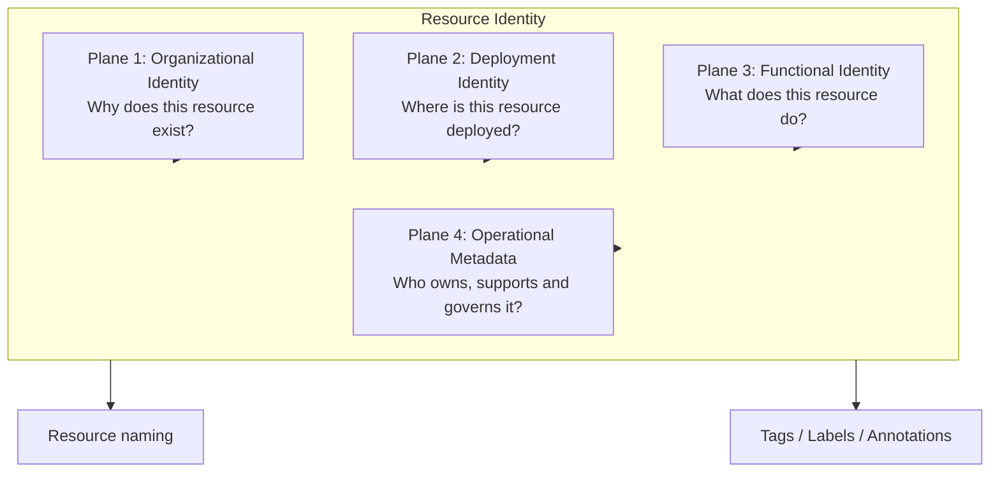

# Resource Identity

Resource Identity is the canonical domain model used to describe *what a resource is* in
a way that is independent of any cloud provider, tool, or naming syntax. It is the shared
vocabulary that every adapter — Terraform, AWS CDK, Ansible, the CLI, and any future
adapter — builds upon.

Resource Identity organizes the information about a resource into four **identity
planes**. Each plane answers a distinct question about the resource and groups together
attributes that tend to change — or not change — at the same rate.

## Plane 1: Organizational Identity

**Purpose:** "Why does this resource exist?"

Organizational Identity captures the organizational context a resource belongs to —
the business or organizational reason for its existence, independent of where or how it
is deployed.

Possible attributes:

- `organization`: Enterprise, company, legal entity, or top-level owner of the resource.
- `business_unit`: Organizational area responsible for or funding the system.
- `system`: Software system, product, or business application to which the resource belongs.
- `tenant`: Optional customer or logical tenant associated with the resource.

These attributes are highly stable. They rarely change over the lifetime of a resource,
because they describe organizational placement rather than technical or operational
details.

## Plane 2: Deployment Identity

**Purpose:** "Where is this resource deployed?"

Deployment Identity captures where a resource lives: the platform, the deployment
boundary within that platform, and the environment and location within that boundary.

Possible attributes:

- `platform`: Infrastructure platform derived from the resource type, resource definition, or adapter.
- `deployment_scope`: Logical identifier for the administrative or isolation boundary where the resource is deployed, such as an AWS account alias, Azure subscription alias, or Kubernetes cluster name.
- `environment`: Lifecycle stage or operational environment in which the resource is used.
- `location`: Logical or physical deployment location when the resource is not global.
- `instance`: Optional discriminator used when multiple equivalent instances of a resource exist.

`platform` is part of the canonical resolved identity, but it is normally derived from
the resource type, resource definition, or adapter rather than repeatedly provided by
the caller.

`deployment_scope` is a logical identifier, not the provider's immutable technical ID.
Prefer `workload-prod` over an AWS account ID, `shared-services` over an Azure
subscription UUID, or `production-eu` over a Kubernetes cluster UID.

Some resources are global and therefore do not require `location`. A Convention Pack or
profile determines whether `deployment_scope`, `environment`, or `location` are required
for a given resource.

## Plane 3: Functional Identity

**Purpose:** "What does this resource do?"

Functional Identity describes the purpose and role of the resource within the systems it
belongs to.

Possible attributes:

- `domain`
- `service`
- `component`
- `resource_type`

This plane follows Domain-Driven Design (DDD) concepts: `domain` and `service` describe
the bounded context and service a resource belongs to, while `component` and
`resource_type` narrow that down to the specific building block being identified.

## Plane 4: Operational Metadata

**Purpose:** "Who owns, supports and governs the resource?"

Operational Metadata captures ownership, support, and governance information about a
resource.

Possible attributes:

- `owner`
- `cost_center`
- `criticality`
- `classification`
- `managed_by`

This plane normally becomes:

- AWS Tags.
- Azure Tags.
- Kubernetes Labels.

Operational Metadata should not usually participate in resource names. It informs
governance, cost allocation, and support processes, but naming conventions are typically
driven by the other three planes.

## Relationships between the planes

The four planes are complementary rather than hierarchical: together they form a
complete Resource Identity, but each plane can be reasoned about independently. In
general, Organizational Identity and Functional Identity attributes are supplied by the
person or system requesting a resource, while Deployment Identity attributes are largely
resolved from the context in which the request is made, and Operational Metadata is
enriched from organizational context and governance rules.

## Resource Identity is the canonical internal model

Resource Identity is the complete, canonical representation of a resource's identity
once all four planes have been resolved. It is the model the Convention Engine operates
on internally, and the model every adapter ultimately consumes to render names, tags,
labels, and annotations.

Resource Identity is **not** the public API. Users of the Specification do not construct
a full Resource Identity by hand; they submit a much smaller request, described in
[`naming-request.md`](./naming-request.md), which is resolved into a complete Resource
Identity by the Convention Engine.
